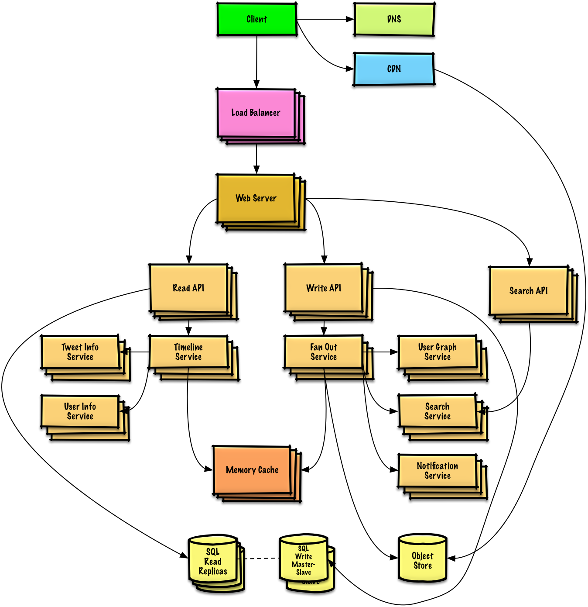
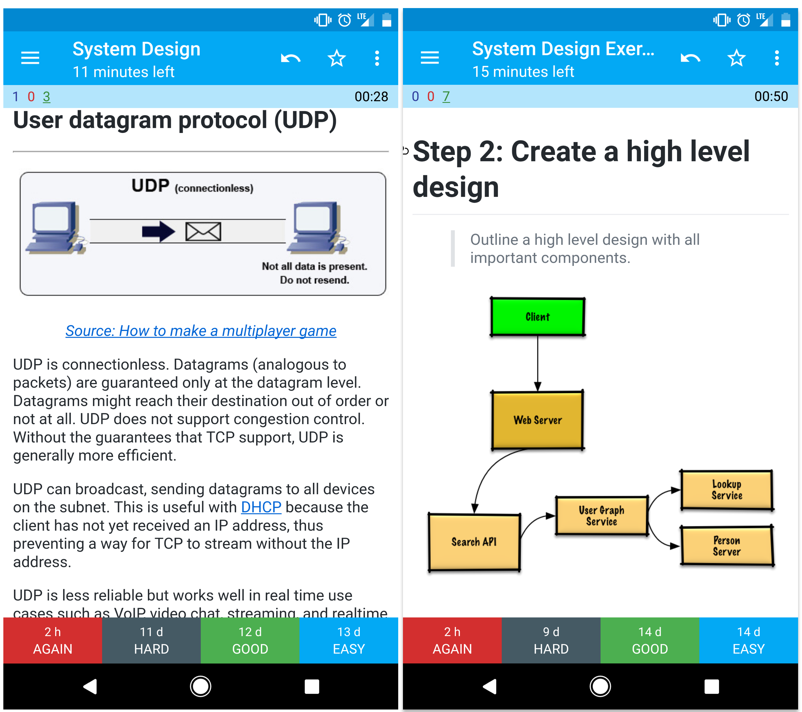

# System Design Learning Path

> Learn how to design large-scale systems.
>
> Prep for the system design interview.

This is the **content layer** for the system design learning app. Every module below is a
self-contained markdown file with YAML frontmatter, cross-linked to the modules it depends on
and the modules that build on it. A machine-readable index of every module lives in
[`manifest.json`](manifest.json).

Content is adapted from [The System Design Primer](https://github.com/donnemartin/system-design-primer)
by Donne Martin, used under CC BY 4.0. See [ATTRIBUTION.md](ATTRIBUTION.md).

---

## Start here

New to system design? Do these two things before anything else:

1. **[System design topics: start here](fundamentals/start-here.md)** — the scalability lecture and article that everything else builds on.
2. **[How to approach a system design interview question](study-guide/interview-approach.md)** — the four-step framework you will reuse in every exercise.

Then pick a timeline below.

---

## Study guide: pick your timeline

> Suggested topics to review based on your interview timeline.


**You do not need to know everything here.** What you are asked depends on your experience, your
technical background, the position, the company, and luck. More experienced candidates are
generally expected to know more about system design. Architects or team leads might be expected to
know more than individual contributors. Top tech companies are likely to have one or more design
interview rounds.

**Start broad and go deeper in a few areas.** It helps to know a little about various key system
design topics. Adjust the guide based on your timeline, experience, what positions you are
interviewing for, and which companies you are interviewing with.

| Track | Goal | Practice |
|---|---|---|
| **[Short timeline](study-guide/short-timeline.md)** | **Breadth** with system design topics | Solve **some** interview questions |
| **[Medium timeline](study-guide/medium-timeline.md)** | **Breadth** and **some depth** | Solve **many** interview questions |
| **[Long timeline](study-guide/long-timeline.md)** | **Breadth** and **more depth** | Solve **most** interview questions |

| Activity | Short | Medium | Long |
|---|---|---|---|
| Read through the [system design topics](#index-of-system-design-topics) to get a broad understanding of how systems work | ✔ | ✔ | ✔ |
| Read through a few articles in the [company engineering blogs](appendix/engineering-blogs.md) for the companies you are interviewing with | ✔ | ✔ | ✔ |
| Read through a few [real world architectures](appendix/real-world-architectures.md) | ✔ | ✔ | ✔ |
| Review [how to approach a system design interview question](study-guide/interview-approach.md) | ✔ | ✔ | ✔ |
| Work through [system design interview questions with solutions](exercises/system-design/README.md) | Some | Many | Most |
| Work through [object-oriented design interview questions with solutions](exercises/object-oriented-design/README.md) | Some | Many | Most |
| Review [additional system design interview questions](appendix/additional-questions.md) | Some | Many | Most |

Full detail: **[Study guide](study-guide/README.md)**.

---

## Index of system design topics

> Summaries of various system design topics, including pros and cons. **Everything is a trade-off.**
>
> Each module links to more in-depth resources.



### [Fundamentals](fundamentals/README.md)

The high-level trade-offs every design conversation returns to.

* [System design topics: start here](fundamentals/start-here.md)
* [Performance vs scalability](fundamentals/performance-vs-scalability.md)
* [Latency vs throughput](fundamentals/latency-vs-throughput.md)
* [Availability vs consistency (CAP theorem)](fundamentals/cap-theorem.md)
* [Consistency patterns](fundamentals/consistency-patterns.md) — weak, eventual, strong
* [Availability patterns](fundamentals/availability-patterns.md) — fail-over, replication, availability in numbers

### [Networking & edge](networking/README.md)

How a request reaches your servers, and how services talk to each other.

* [Domain name system](networking/dns.md)
* [Content delivery network](networking/cdn.md) — push CDNs, pull CDNs
* [Load balancer](networking/load-balancer.md) — active-passive, active-active, layer 4, layer 7, horizontal scaling
* [Reverse proxy (web server)](networking/reverse-proxy.md)
* [Hypertext transfer protocol (HTTP)](networking/http.md)
* [TCP and UDP](networking/tcp-and-udp.md)
* [Remote procedure call (RPC)](networking/rpc.md)
* [Representational state transfer (REST)](networking/rest.md)

### [Application layer](application/README.md)

Splitting the web tier from the platform tier, and moving work off the request path.

* [Application layer](application/application-layer.md)
* [Microservices](application/microservices.md)
* [Service discovery](application/service-discovery.md)
* [Asynchronism](application/asynchronism.md) — message queues, task queues, back pressure

### [Data](data/README.md)

Where the state lives, and every technique for making it hold up under load.

* [Relational database management system (RDBMS)](data/rdbms.md) — ACID
    * [Replication](data/replication.md) — master-slave, master-master
    * [Federation](data/federation.md)
    * [Sharding](data/sharding.md)
    * [Denormalization](data/denormalization.md)
    * [SQL tuning](data/sql-tuning.md)
* [NoSQL](data/nosql.md) — BASE
    * [Key-value store](data/key-value-store.md)
    * [Document store](data/document-store.md)
    * [Wide column store](data/wide-column-store.md)
    * [Graph database](data/graph-database.md)
* [SQL or NoSQL](data/sql-or-nosql.md)

### [Caching](caching/README.md)

The cheapest way to make a system faster, and the hardest thing to keep correct.

* [Caching overview](caching/caching-overview.md)
* [Where to cache](caching/cache-locations.md) — client, CDN, web server, database, application
* [What to cache](caching/what-to-cache.md) — database query level, object level
* [When to update the cache](caching/cache-update-strategies.md) — cache-aside, write-through, write-behind, refresh-ahead

### [Security](security/README.md)

* [Security basics](security/security-basics.md)

### [Appendix](appendix/README.md)

* [Back-of-the-envelope calculations](appendix/back-of-the-envelope.md)
* [Powers of two table](appendix/powers-of-two.md)
* [Latency numbers every programmer should know](appendix/latency-numbers.md)
* [Additional system design interview questions](appendix/additional-questions.md)
* [Real world architectures](appendix/real-world-architectures.md)
* [Company architectures](appendix/company-architectures.md)
* [Company engineering blogs](appendix/engineering-blogs.md)
* [Under development](appendix/under-development.md)

---

## Exercises

> Common interview questions with sample discussions, code, and diagrams.

### [System design exercises](exercises/system-design/README.md)

| Exercise | |
|---|---|
| Design Pastebin.com (or Bit.ly) | [Solution](exercises/system-design/pastebin/README.md) |
| Design the Twitter timeline and search (or Facebook feed and search) | [Solution](exercises/system-design/twitter/README.md) |
| Design a web crawler | [Solution](exercises/system-design/web-crawler/README.md) |
| Design Mint.com | [Solution](exercises/system-design/mint/README.md) |
| Design the data structures for a social network | [Solution](exercises/system-design/social-graph/README.md) |
| Design a key-value store for a search engine | [Solution](exercises/system-design/query-cache/README.md) |
| Design Amazon's sales ranking by category feature | [Solution](exercises/system-design/sales-rank/README.md) |
| Design a system that scales to millions of users on AWS | [Solution](exercises/system-design/scaling-aws/README.md) |

### [Object-oriented design exercises](exercises/object-oriented-design/README.md)

| Exercise | |
|---|---|
| Design a hash map | [Solution](exercises/object-oriented-design/hash-map.md) |
| Design a least recently used cache | [Solution](exercises/object-oriented-design/lru-cache.md) |
| Design a call center | [Solution](exercises/object-oriented-design/call-center.md) |
| Design a deck of cards | [Solution](exercises/object-oriented-design/deck-of-cards.md) |
| Design a parking lot | [Solution](exercises/object-oriented-design/parking-lot.md) |
| Design a chat server | [Solution](exercises/object-oriented-design/online-chat.md) |

---

## Spaced repetition

The primer ships [Anki flashcard decks](study-guide/flashcards.md) that use spaced repetition to
help retain key concepts. Every module in this path also ends with a **Self-check** section whose
questions can be lifted directly into a review queue.



---

## Content conventions

Every module file carries frontmatter with a stable shape:

```yaml
---
id: cap-theorem                    # unique slug, stable across edits
title: Availability vs Consistency # display title
module: fundamentals               # parent module directory
module_order: 20                   # sort order of the module itself (index files only)
order: 30                          # sort order within the module
est_minutes: 8                     # estimated read time
timelines: [short, medium, long]   # which study tracks include this
tags: [tradeoffs, distributed-systems]
prerequisites: [latency-vs-throughput]  # ids that should come first
related: [consistency-patterns]         # ids worth reading alongside
source: https://github.com/donnemartin/system-design-primer#cap-theorem
---
```

* `id` is the join key. The backend should treat it as the primary key; filenames may move.
* `prerequisites` and `related` reference other `id`s, forming the graph the frontend can render
  as a dependency map or "up next" rail.
* `order` sorts entries **within** a module; `module_order` sorts the **modules** against each
  other. Both are spaced by 10 so a new entry or module can be slotted in without renumbering.
  `order: 0` is reserved for a module's own `README.md`; `order: 900` parks an entry at the end.
* `module_order` is declared only on module index files (`*/README.md`) — that file is the module's
  metadata home. It is mirrored into `manifest.json` under both `modules[]` and the matching index
  entry, and `modules[]`/`entries[]` are kept sorted by it, so consumers never depend on JSON array
  position for ordering.
* `timelines` drives the short/medium/long track filters.
* Images are local under [`assets/images/`](assets/images) — nothing loads from a remote host.

---

## License

Content adapted from [The System Design Primer](https://github.com/donnemartin/system-design-primer),
Copyright 2017 Donne Martin, licensed under
[CC BY 4.0](http://creativecommons.org/licenses/by/4.0/). See [ATTRIBUTION.md](ATTRIBUTION.md) for
details and the full source map.
