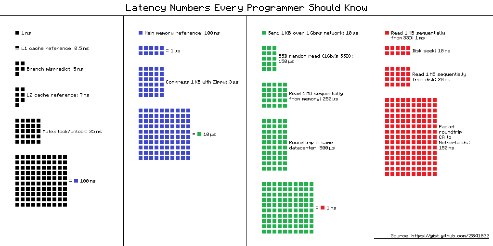

# Latency Numbers Every Programmer Should Know

```
Latency Comparison Numbers
--------------------------
L1 cache reference                           0.5 ns
Branch mispredict                            5   ns
L2 cache reference                           7   ns                      14x L1 cache
Mutex lock/unlock                           25   ns
Main memory reference                      100   ns                      20x L2 cache, 200x L1 cache
Compress 1K bytes with Zippy            10,000   ns       10 us
Send 1 KB bytes over 1 Gbps network     10,000   ns       10 us
Read 4 KB randomly from SSD*           150,000   ns      150 us          ~1GB/sec SSD
Read 1 MB sequentially from memory     250,000   ns      250 us
Round trip within same datacenter      500,000   ns      500 us
Read 1 MB sequentially from SSD*     1,000,000   ns    1,000 us    1 ms  ~1GB/sec SSD, 4X memory
HDD seek                            10,000,000   ns   10,000 us   10 ms  20x datacenter roundtrip
Read 1 MB sequentially from 1 Gbps  10,000,000   ns   10,000 us   10 ms  40x memory, 10X SSD
Read 1 MB sequentially from HDD     30,000,000   ns   30,000 us   30 ms 120x memory, 30X SSD
Send packet CA->Netherlands->CA    150,000,000   ns  150,000 us  150 ms

Notes
-----
1 ns = 10^-9 seconds
1 us = 10^-6 seconds = 1,000 ns
1 ms = 10^-3 seconds = 1,000 us = 1,000,000 ns
```

## Handy metrics based on the numbers above

* Read sequentially from HDD at **30 MB/s**
* Read sequentially from 1 Gbps Ethernet at **100 MB/s**
* Read sequentially from SSD at **1 GB/s**
* Read sequentially from main memory at **4 GB/s**
* **6-7 world-wide round trips** per second
* **2,000 round trips** per second within a data center

## Latency numbers visualized



## Why these numbers decide designs

* Memory is ~**4x faster than SSD** and ~**120x faster than HDD** for sequential 1 MB reads. That
  ratio is the entire argument for an [in-memory cache](../caching/cache-locations.md#application-caching).
* A datacenter round trip (500 us) is **2x the cost of reading 1 MB from memory**. Chatty
  [RPC](../networking/rpc.md) or [REST](../networking/rest.md) call chains add up fast — this is why
  REST's "multiple round trips for nested resources" is listed as a real disadvantage.
* A cross-continent round trip is **150 ms**, ~300x a datacenter round trip. That is the argument
  for a [CDN](../networking/cdn.md) and for geolocation-based [DNS routing](../networking/dns.md).
* Keeping an [index in memory](../data/sql-tuning.md#use-good-indices) rather than on disk is the
  difference between 250 us and 30 ms.

## Source(s) and further reading

* [Latency numbers every programmer should know - 1](https://gist.github.com/jboner/2841832)
* [Latency numbers every programmer should know - 2](https://gist.github.com/hellerbarde/2843375)
* [Designs, lessons, and advice from building large distributed systems](http://www.cs.cornell.edu/projects/ladis2009/talks/dean-keynote-ladis2009.pdf)
* [Software Engineering Advice from Building Large-Scale Distributed Systems](https://static.googleusercontent.com/media/research.google.com/en//people/jeff/stanford-295-talk.pdf)

## Self-check

1. How long is a round trip within the same datacenter? Across the world?
2. How much slower is a 1 MB sequential read from HDD than from memory?
3. Roughly how many datacenter round trips can you do per second?
4. Reading 1 MB from SSD vs memory — what is the ratio, and what does it imply for cache sizing?
