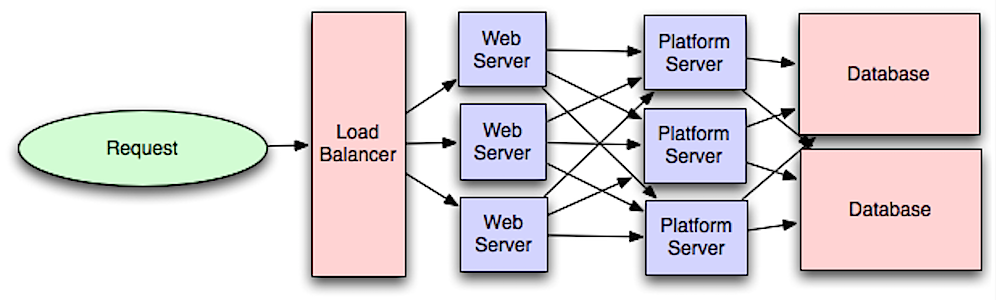

# Application Layer (Platform Layer)

  
   
  <i><a href="http://lethain.com/introduction-to-architecting-systems-for-scale/#platform_layer">Source: Intro to architecting systems for scale</a></i>

Separating out the **web layer** from the **application layer** (also known as the platform layer)
allows you to **scale and configure both layers independently**. Adding a new API results in adding
application servers without necessarily adding additional web servers.

The **single responsibility principle** advocates for small and autonomous services that work
together. Small teams with small services can plan more aggressively for rapid growth.

Workers in the application layer also help enable [asynchronism](asynchronism.md).

## Related concepts

* [Microservices](microservices.md) — the decomposition this layer enables
* [Service discovery](service-discovery.md) — how those services locate one another
* [Reverse proxy](../networking/reverse-proxy.md) — the web layer this is separated from

## Disadvantage(s): application layer

* Adding an application layer with loosely coupled services requires a **different approach from an
  architectural, operations, and process viewpoint** (vs a monolithic system).
* Microservices can add **complexity in terms of deployments and operations**.

## Source(s) and further reading

* [Intro to architecting systems for scale](http://lethain.com/introduction-to-architecting-systems-for-scale)
* [Crack the system design interview](http://www.puncsky.com/blog/2016-02-13-crack-the-system-design-interview)
* [Service oriented architecture](https://en.wikipedia.org/wiki/Service-oriented_architecture)
* [Introduction to Zookeeper](http://www.slideshare.net/sauravhaloi/introduction-to-apache-zookeeper)
* [Here's what you need to know about building microservices](https://cloudncode.wordpress.com/2016/07/22/msa-getting-started/)

## Self-check

1. What do you gain by separating the web layer from the application layer?
2. What does the single responsibility principle advocate at the service level, and what team-level benefit follows?
3. Name the two disadvantages of introducing an application layer.
