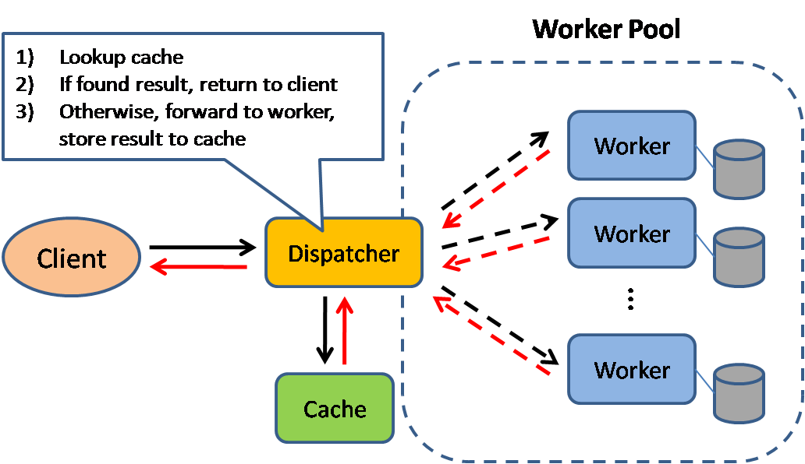

# Caching

  
   
  <i><a href="http://horicky.blogspot.com/2010/10/scalable-system-design-patterns.html">Source: Scalable system design patterns</a></i>

The cheapest way to make a system faster, and the hardest thing to keep correct.

## Modules

| # | Module | Time | What it answers |
|---|---|---|---|
| 1 | [Caching overview](caching-overview.md) | 4 min | Why cache at all, and what does it cost? |
| 2 | [Where to cache](cache-locations.md) | 5 min | Client, CDN, web server, database, or application? |
| 3 | [What to cache](what-to-cache.md) | 4 min | Query results or assembled objects? |
| 4 | [When to update the cache](cache-update-strategies.md) | 8 min | Cache-aside, write-through, write-behind, refresh-ahead |

## The three questions

Every caching decision decomposes into the same three questions, which is why the modules are split
this way:

1. **Where** does the cache live? → [cache-locations.md](cache-locations.md)
2. **What** granularity do you store? → [what-to-cache.md](what-to-cache.md)
3. **When** does it get written or invalidated? → [cache-update-strategies.md](cache-update-strategies.md)

## Where this leads

* A [CDN](../networking/cdn.md) is a cache; push vs pull is its update strategy.
* A [reverse proxy](../networking/reverse-proxy.md) is a web server cache.
* [Redis and Memcached](../data/key-value-store.md) are the usual application cache.
* Cache consistency is a direct application of [consistency patterns](../fundamentals/consistency-patterns.md).
