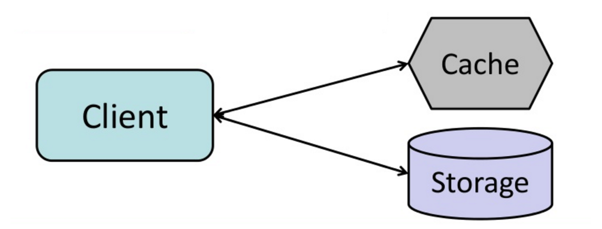
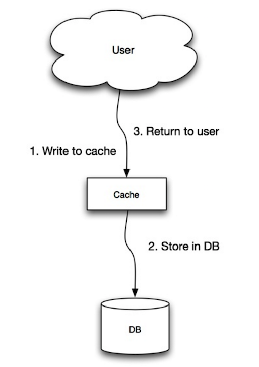
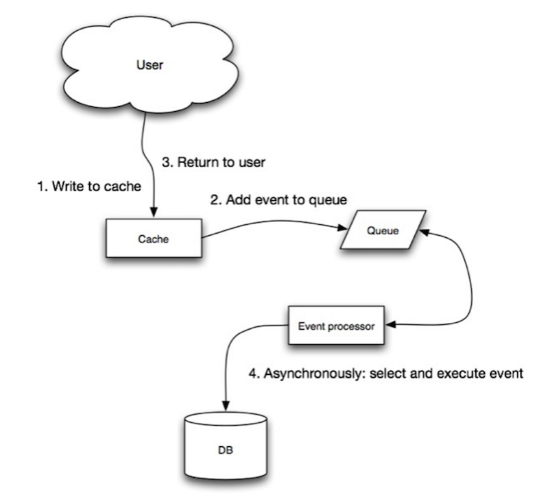
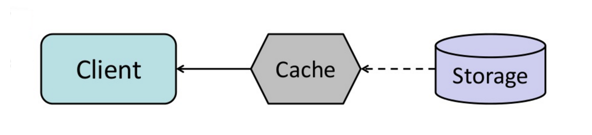

# When to Update the Cache

Since you can only store a **limited amount of data** in cache, you'll need to determine which cache
update strategy works best for your use case.

## Cache-aside

<p align="center">
  
  <br/>
  <i><a href="http://www.slideshare.net/tmatyashovsky/from-cache-to-in-memory-data-grid-introduction-to-hazelcast">Source: From cache to in-memory data grid</a></i>
</p>

The **application** is responsible for reading and writing from storage. **The cache does not
interact with storage directly.** The application does the following:

* Look for entry in cache, resulting in a cache miss
* Load entry from the database
* Add entry to cache
* Return entry

```python
def get_user(self, user_id):
    user = cache.get("user.{0}", user_id)
    if user is None:
        user = db.query("SELECT * FROM users WHERE user_id = {0}", user_id)
        if user is not None:
            key = "user.{0}".format(user_id)
            cache.set(key, json.dumps(user))
    return user
```

[Memcached](https://memcached.org/) is generally used in this manner.

Subsequent reads of data added to cache are fast. Cache-aside is also referred to as **lazy
loading**. Only requested data is cached, which **avoids filling up the cache with data that isn't
requested**.

### Disadvantage(s): cache-aside

* Each cache miss results in **three trips**, which can cause a noticeable delay.
* Data can become **stale** if it is updated in the database. This issue is mitigated by setting a
  **time-to-live (TTL)** which forces an update of the cache entry, or by using write-through.
* When a node fails, it is replaced by a **new, empty node**, increasing latency.

## Write-through

<p align="center">
  
  <br/>
  <i><a href="http://www.slideshare.net/jboner/scalability-availability-stability-patterns/">Source: Scalability, availability, stability, patterns</a></i>
</p>

The application uses the **cache as the main data store**, reading and writing data to it, while the
**cache is responsible** for reading and writing to the database:

* Application adds/updates entry in cache
* Cache **synchronously** writes entry to data store
* Return

Application code:

```python
set_user(12345, {"foo":"bar"})
```

Cache code:

```python
def set_user(user_id, values):
    user = db.query("UPDATE Users WHERE id = {0}", user_id, values)
    cache.set(user_id, user)
```

Write-through is a **slow overall operation** due to the write operation, but **subsequent reads of
just-written data are fast**. Users are generally more tolerant of latency when updating data than
when reading data. **Data in the cache is not stale.**

### Disadvantage(s): write-through

* When a new node is created due to failure or scaling, the new node will **not cache entries until
  the entry is updated in the database**. Cache-aside in conjunction with write-through can mitigate
  this issue.
* **Most data written might never be read**, which can be minimized with a TTL.

## Write-behind (write-back)

<p align="center">
  
  <br/>
  <i><a href="http://www.slideshare.net/jboner/scalability-availability-stability-patterns/">Source: Scalability, availability, stability, patterns</a></i>
</p>

In write-behind, the application does the following:

* Add/update entry in cache
* **Asynchronously** write entry to the data store, improving write performance

This is [asynchronism](../application/asynchronism.md) applied to the write path — same trade, same
risk.

### Disadvantage(s): write-behind

* There could be **data loss** if the cache goes down prior to its contents hitting the data store.
* It is **more complex to implement** write-behind than it is to implement cache-aside or write-through.

## Refresh-ahead

<p align="center">
  
  <br/>
  <i><a href="http://www.slideshare.net/tmatyashovsky/from-cache-to-in-memory-data-grid-introduction-to-hazelcast">Source: From cache to in-memory data grid</a></i>
</p>

You can configure the cache to **automatically refresh any recently accessed cache entry prior to
its expiration**.

Refresh-ahead can result in **reduced latency** vs read-through **if the cache can accurately
predict** which items are likely to be needed in the future.

### Disadvantage(s): refresh-ahead

* **Not accurately predicting** which items are likely to be needed in the future can result in
  **reduced performance** than without refresh-ahead.

## At a glance

| Strategy | Who writes to the DB | Write latency | Staleness | Main risk |
|---|---|---|---|---|
| **Cache-aside** | application | normal | possible, bounded by TTL | 3 trips on a miss; cold node after failure |
| **Write-through** | cache, synchronously | high | none | writes data that may never be read |
| **Write-behind** | cache, asynchronously | low | none in cache | data loss if cache dies before flush |
| **Refresh-ahead** | (paired with a read strategy) | — | low if prediction is good | wasted refreshes on bad prediction |

## Self-check

1. In cache-aside, what are the four steps on a cache miss, and why is it called lazy loading?
2. Which strategy guarantees the cache is never stale, and what does it cost?
3. Why is a freshly replaced node a problem for write-through, and what mitigates it?
4. What is the failure mode of write-behind?
5. When does refresh-ahead make things worse rather than better?
6. Which two strategies are often combined, and why?
