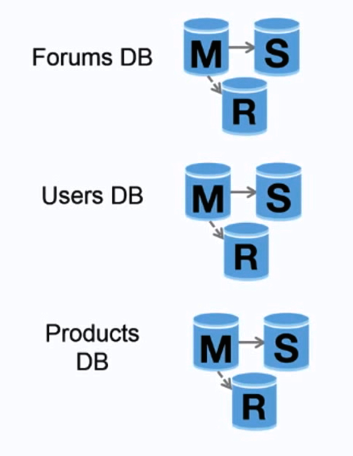

# Federation (Functional Partitioning)

  
   
  <i><a href="https://www.youtube.com/watch?v=kKjm4ehYiMs">Source: Scaling up to your first 10 million users</a></i>

Federation (or functional partitioning) **splits up databases by function**. For example, instead of
a single, monolithic database, you could have three databases: **forums**, **users**, and
**products**.

The benefits chain together:

* Less read and write traffic to each database, and therefore **less replication lag**
* Smaller databases mean **more data fits in memory**, which means **more cache hits** due to improved cache locality
* With **no single central master serializing writes**, you can write in parallel, **increasing throughput**

Federation splits by *function*; [sharding](sharding.md) splits the same function's data by *key*.
They are complementary and often used together.

## Disadvantage(s): federation

* Federation is **not effective if your schema requires huge functions or tables**.
* You'll need to **update your application logic** to determine which database to read from and write to.
* Joining data from two databases is more complex with a
  [server link](http://stackoverflow.com/questions/5145637/querying-data-by-joining-two-tables-in-two-database-on-different-servers).
* Federation adds **more hardware and additional complexity**.

## Source(s) and further reading: federation

* [Scaling up to your first 10 million users](https://www.youtube.com/watch?v=kKjm4ehYiMs)

## Self-check

1. On what axis does federation split data, and how does that differ from sharding?
2. Trace the chain from "smaller database" to "more cache hits".
3. Why does removing the single central master increase write throughput?
4. When is federation ineffective?
