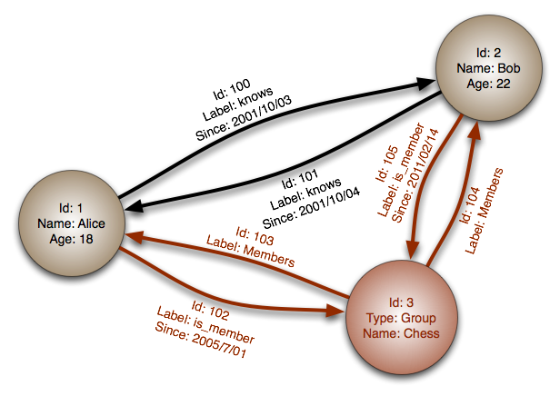

# Graph Database

  
   
  <i><a href="https://en.wikipedia.org/wiki/File:GraphDatabase_PropertyGraph.png">Source: Graph database</a></i>

> **Abstraction: graph**

In a graph database, **each node is a record** and **each arc is a relationship** between two nodes.
Graph databases are optimized to represent **complex relationships with many foreign keys or
many-to-many relationships**.

Graph databases offer **high performance for data models with complex relationships**, such as a
social network. They are relatively new and are **not yet widely used**; it might be more difficult
to find development tools and resources. Many graphs can only be accessed with
[REST APIs](../networking/rest.md).

For a worked example of modeling a social network — including when *not* to reach for a graph
database — see [design the data structures for a social network](../exercises/system-design/social-graph/README.md).

## Source(s) and further reading: graph

* [Graph database](https://en.wikipedia.org/wiki/Graph_database)
* [Neo4j](https://neo4j.com/)
* [FlockDB](https://blog.twitter.com/2010/introducing-flockdb)

## Self-check

1. What do nodes and arcs represent?
2. What data shape are graph databases optimized for, and give an example product.
3. Name two practical drawbacks of choosing a graph database today.
