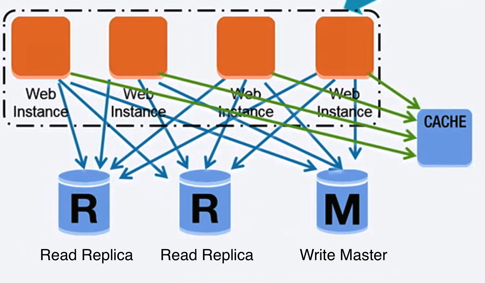

# Relational Database Management System (RDBMS)

  
   
  <i><a href="https://www.youtube.com/watch?v=kKjm4ehYiMs">Source: Scaling up to your first 10 million users</a></i>

A relational database like SQL is a **collection of data items organized in tables**.

## ACID

**ACID** is a set of properties of relational database
[transactions](https://en.wikipedia.org/wiki/Database_transaction).

* **Atomicity** — each transaction is all or nothing
* **Consistency** — any transaction will bring the database from one valid state to another
* **Isolation** — executing transactions concurrently has the same results as if the transactions were executed serially
* **Durability** — once a transaction has been committed, it will remain so

ACID is what [strong consistency](../fundamentals/consistency-patterns.md#strong-consistency) looks
like at the database level. Compare with [BASE](nosql.md), the NoSQL counterpart, which chooses
availability instead.

## Techniques to scale a relational database

There are many techniques to scale a relational database:

* **[Master-slave replication](replication.md#master-slave-replication)** — scale reads
* **[Master-master replication](replication.md#master-master-replication)** — scale reads and writes
* **[Federation](federation.md)** — split by function
* **[Sharding](sharding.md)** — split by key
* **[Denormalization](denormalization.md)** — avoid expensive joins
* **[SQL tuning](sql-tuning.md)** — get more out of what you have

Each of these is covered in its own module. They compose: a real system typically tunes first,
replicates second, and only shards when the earlier steps run out.

## Self-check

1. Expand ACID and define each property in one line.
2. Which consistency pattern does an ACID database implement?
3. List the six techniques for scaling a relational database, and say whether each targets reads, writes, or both.
