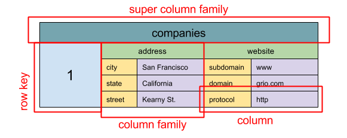

# Wide Column Store

  
   
  <i><a href="http://blog.grio.com/2015/11/sql-nosql-a-brief-history.html">Source: SQL & NoSQL, a brief history</a></i>

> **Abstraction: nested map** `ColumnFamily<RowKey, Columns<ColKey, Value, Timestamp>>`

A wide column store's basic unit of data is a **column** (name/value pair). A column can be grouped
in **column families** (analogous to a SQL table). **Super column families** further group column
families. You can access each column independently with a **row key**, and columns with the same row
key form a **row**. Each value contains a **timestamp for versioning and for conflict resolution**.

Google introduced [Bigtable](http://www.read.seas.harvard.edu/~kohler/class/cs239-w08/chang06bigtable.pdf)
as the first wide column store, which influenced the open-source
[HBase](https://www.edureka.co/blog/hbase-architecture/) often used in the Hadoop ecosystem, and
[Cassandra](http://docs.datastax.com/en/cassandra/3.0/cassandra/architecture/archIntro.html) from
Facebook. Stores such as BigTable, HBase, and Cassandra maintain keys in **lexicographic order**,
allowing efficient retrieval of selective key ranges.

Wide column stores offer **high availability and high scalability**. They are often used for **very
large data sets**.

## Source(s) and further reading: wide column store

* [SQL & NoSQL, a brief history](http://blog.grio.com/2015/11/sql-nosql-a-brief-history.html)
* [Bigtable architecture](http://www.read.seas.harvard.edu/~kohler/class/cs239-w08/chang06bigtable.pdf)
* [HBase architecture](https://www.edureka.co/blog/hbase-architecture/)
* [Cassandra architecture](http://docs.datastax.com/en/cassandra/3.0/cassandra/architecture/archIntro.html)

## Self-check

1. Write out the nested-map abstraction and name each level.
2. What is a column family analogous to in SQL?
3. What is the timestamp on each value used for?
4. What does maintaining lexicographic key order buy you here?
