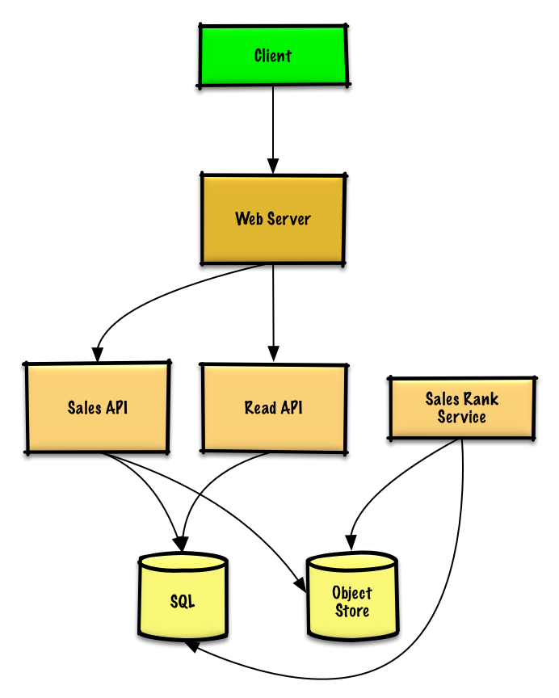
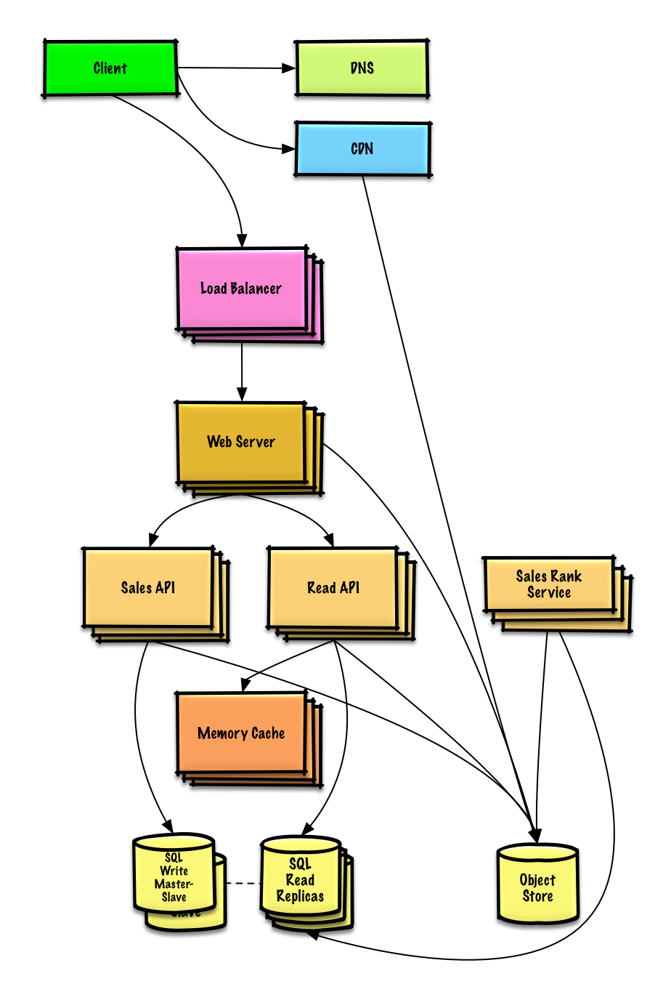

# Design Amazon's sales rank by category feature

> **How to use this exercise:** work through it yourself using the [four-step framework](../../../study-guide/interview-approach.md) *before* reading the solution below. Links point into the [topic modules](../../../README.md) rather than repeating their content — follow them for general talking points, trade-offs, and alternatives.

## Step 1: Outline use cases and constraints

> Gather requirements and scope the problem.
> Ask questions to clarify use cases and constraints.
> Discuss assumptions.

Without an interviewer to address clarifying questions, we'll define some use cases and constraints.

### Use cases

#### We'll scope the problem to handle only the following use case

* **Service** calculates the past week's most popular products by category
* **User** views the past week's most popular products by category
* **Service** has high availability

#### Out of scope

* The general e-commerce site
    * Design components only for calculating sales rank

### Constraints and assumptions

#### State assumptions

* Traffic is not evenly distributed
* Items can be in multiple categories
* Items cannot change categories
* There are no subcategories ie `foo/bar/baz`
* Results must be updated hourly
    * More popular products might need to be updated more frequently
* 10 million products
* 1000 categories
* 1 billion transactions per month
* 100 billion read requests per month
* 100:1 read to write ratio

#### Calculate usage

**Clarify with your interviewer if you should run back-of-the-envelope usage calculations.**

* Size per transaction:
    * `created_at` - 5 bytes
    * `product_id` - 8 bytes
    * `category_id` - 4 bytes
    * `seller_id` - 8 bytes
    * `buyer_id` - 8 bytes
    * `quantity` - 4 bytes
    * `total_price` - 5 bytes
    * Total: ~40 bytes
* 40 GB of new transaction content per month
    * 40 bytes per transaction * 1 billion transactions per month
    * 1.44 TB of new transaction content in 3 years
    * Assume most are new transactions instead of updates to existing ones
* 400 transactions per second on average
* 40,000 read requests per second on average

Handy conversion guide:

* 2.5 million seconds per month
* 1 request per second = 2.5 million requests per month
* 40 requests per second = 100 million requests per month
* 400 requests per second = 1 billion requests per month

## Step 2: Create a high level design

> Outline a high level design with all important components.



## Step 3: Design core components

> Dive into details for each core component.

### Use case: Service calculates the past week's most popular products by category

We could store the raw **Sales API** server log files on a managed **Object Store** such as Amazon S3, rather than managing our own distributed file system.

**Clarify with your interviewer how much code you are expected to write**.

We'll assume this is a sample log entry, tab delimited:

```
timestamp   product_id  category_id    qty     total_price   seller_id    buyer_id
t1          product1    category1      2       20.00         1            1
t2          product1    category2      2       20.00         2            2
t2          product1    category2      1       10.00         2            3
t3          product2    category1      3        7.00         3            4
t4          product3    category2      7        2.00         4            5
t5          product4    category1      1        5.00         5            6
...
```

The **Sales Rank Service** could use **MapReduce**, using the **Sales API** server log files as input and writing the results to an aggregate table `sales_rank` in a **SQL Database**.  We should discuss the [use cases and tradeoffs between choosing SQL or NoSQL](../../../data/sql-or-nosql.md).

We'll use a multi-step **MapReduce**:

* **Step 1** - Transform the data to `(category, product_id), sum(quantity)`
* **Step 2** - Perform a distributed sort

```python
class SalesRanker(MRJob):

    def within_past_week(self, timestamp):
        """Return True if timestamp is within past week, False otherwise."""
        ...

    def mapper(self, _ line):
        """Parse each log line, extract and transform relevant lines.

        Emit key value pairs of the form:

        (category1, product1), 2
        (category2, product1), 2
        (category2, product1), 1
        (category1, product2), 3
        (category2, product3), 7
        (category1, product4), 1
        """
        timestamp, product_id, category_id, quantity, total_price, seller_id, \
            buyer_id = line.split('\t')
        if self.within_past_week(timestamp):
            yield (category_id, product_id), quantity

    def reducer(self, key, value):
        """Sum values for each key.

        (category1, product1), 2
        (category2, product1), 3
        (category1, product2), 3
        (category2, product3), 7
        (category1, product4), 1
        """
        yield key, sum(values)

    def mapper_sort(self, key, value):
        """Construct key to ensure proper sorting.

        Transform key and value to the form:

        (category1, 2), product1
        (category2, 3), product1
        (category1, 3), product2
        (category2, 7), product3
        (category1, 1), product4

        The shuffle/sort step of MapReduce will then do a
        distributed sort on the keys, resulting in:

        (category1, 1), product4
        (category1, 2), product1
        (category1, 3), product2
        (category2, 3), product1
        (category2, 7), product3
        """
        category_id, product_id = key
        quantity = value
        yield (category_id, quantity), product_id

    def reducer_identity(self, key, value):
        yield key, value

    def steps(self):
        """Run the map and reduce steps."""
        return [
            self.mr(mapper=self.mapper,
                    reducer=self.reducer),
            self.mr(mapper=self.mapper_sort,
                    reducer=self.reducer_identity),
        ]
```

The result would be the following sorted list, which we could insert into the `sales_rank` table:

```
(category1, 1), product4
(category1, 2), product1
(category1, 3), product2
(category2, 3), product1
(category2, 7), product3
```

The `sales_rank` table could have the following structure:

```
id int NOT NULL AUTO_INCREMENT
category_id int NOT NULL
total_sold int NOT NULL
product_id int NOT NULL
PRIMARY KEY(id)
FOREIGN KEY(category_id) REFERENCES Categories(id)
FOREIGN KEY(product_id) REFERENCES Products(id)
```

We'll create an [index](../../../data/sql-tuning.md#use-good-indices) on `id `, `category_id`, and `product_id` to speed up lookups (log-time instead of scanning the entire table) and to keep the data in memory.  Reading 1 MB sequentially from memory takes about 250 microseconds, while reading from SSD takes 4x and from disk takes 80x longer.<sup>[1](../../../appendix/latency-numbers.md)</sup>

### Use case: User views the past week's most popular products by category

* The **Client** sends a request to the **Web Server**, running as a [reverse proxy](../../../networking/reverse-proxy.md)
* The **Web Server** forwards the request to the **Read API** server
* The **Read API** server reads from the **SQL Database** `sales_rank` table

We'll use a public [**REST API**](../../../networking/rest.md):

```
$ curl https://amazon.com/api/v1/popular?category_id=1234
```

Response:

```
{
    "id": "100",
    "category_id": "1234",
    "total_sold": "100000",
    "product_id": "50",
},
{
    "id": "53",
    "category_id": "1234",
    "total_sold": "90000",
    "product_id": "200",
},
{
    "id": "75",
    "category_id": "1234",
    "total_sold": "80000",
    "product_id": "3",
},
```

For internal communications, we could use [Remote Procedure Calls](../../../networking/rpc.md).

## Step 4: Scale the design

> Identify and address bottlenecks, given the constraints.



**Important: Do not simply jump right into the final design from the initial design!**

State you would 1) **Benchmark/Load Test**, 2) **Profile** for bottlenecks 3) address bottlenecks while evaluating alternatives and trade-offs, and 4) repeat.  See [Design a system that scales to millions of users on AWS](../scaling-aws/README.md) as a sample on how to iteratively scale the initial design.

It's important to discuss what bottlenecks you might encounter with the initial design and how you might address each of them.  For example, what issues are addressed by adding a **Load Balancer** with multiple **Web Servers**?  **CDN**?  **Master-Slave Replicas**?  What are the alternatives and **Trade-Offs** for each?

We'll introduce some components to complete the design and to address scalability issues.  Internal load balancers are not shown to reduce clutter.

*To avoid repeating discussions*, refer to the following [system design topics](../../../README.md#index-of-system-design-topics) for main talking points, tradeoffs, and alternatives:

* [DNS](../../../networking/dns.md)
* [CDN](../../../networking/cdn.md)
* [Load balancer](../../../networking/load-balancer.md)
* [Horizontal scaling](../../../networking/load-balancer.md#horizontal-scaling)
* [Web server (reverse proxy)](../../../networking/reverse-proxy.md)
* [API server (application layer)](../../../application/application-layer.md)
* [Cache](../../../caching/caching-overview.md)
* [Relational database management system (RDBMS)](../../../data/rdbms.md)
* [SQL write master-slave failover](../../../fundamentals/availability-patterns.md#fail-over)
* [Master-slave replication](../../../data/replication.md#master-slave-replication)
* [Consistency patterns](../../../fundamentals/consistency-patterns.md)
* [Availability patterns](../../../fundamentals/availability-patterns.md)

The **Analytics Database** could use a data warehousing solution such as Amazon Redshift or Google BigQuery.

We might only want to store a limited time period of data in the database, while storing the rest in a data warehouse or in an **Object Store**.  An **Object Store** such as Amazon S3 can comfortably handle the constraint of 40 GB of new content per month.

To address the 40,000 *average* read requests per second (higher at peak), traffic for popular content (and their sales rank) should be handled by the **Memory Cache** instead of the database.  The **Memory Cache** is also useful for handling the unevenly distributed traffic and traffic spikes.  With the large volume of reads, the **SQL Read Replicas** might not be able to handle the cache misses.  We'll probably need to employ additional SQL scaling patterns.

400 *average* writes per second (higher at peak) might be tough for a single **SQL Write Master-Slave**, also pointing to a need for additional scaling techniques.

SQL scaling patterns include:

* [Federation](../../../data/federation.md)
* [Sharding](../../../data/sharding.md)
* [Denormalization](../../../data/denormalization.md)
* [SQL Tuning](../../../data/sql-tuning.md)

We should also consider moving some data to a **NoSQL Database**.

## Additional talking points

> Additional topics to dive into, depending on the problem scope and time remaining.

#### NoSQL

* [Key-value store](../../../data/key-value-store.md)
* [Document store](../../../data/document-store.md)
* [Wide column store](../../../data/wide-column-store.md)
* [Graph database](../../../data/graph-database.md)
* [SQL vs NoSQL](../../../data/sql-or-nosql.md)

### Caching

* Where to cache
    * [Client caching](../../../caching/cache-locations.md#client-caching)
    * [CDN caching](../../../caching/cache-locations.md#cdn-caching)
    * [Web server caching](../../../caching/cache-locations.md#web-server-caching)
    * [Database caching](../../../caching/cache-locations.md#database-caching)
    * [Application caching](../../../caching/cache-locations.md#application-caching)
* What to cache
    * [Caching at the database query level](../../../caching/what-to-cache.md#caching-at-the-database-query-level)
    * [Caching at the object level](../../../caching/what-to-cache.md#caching-at-the-object-level)
* When to update the cache
    * [Cache-aside](../../../caching/cache-update-strategies.md#cache-aside)
    * [Write-through](../../../caching/cache-update-strategies.md#write-through)
    * [Write-behind (write-back)](../../../caching/cache-update-strategies.md#write-behind-write-back)
    * [Refresh ahead](../../../caching/cache-update-strategies.md#refresh-ahead)

### Asynchronism and microservices

* [Message queues](../../../application/asynchronism.md#message-queues)
* [Task queues](../../../application/asynchronism.md#task-queues)
* [Back pressure](../../../application/asynchronism.md#back-pressure)
* [Microservices](../../../application/microservices.md)

### Communications

* Discuss tradeoffs:
    * External communication with clients - [HTTP APIs following REST](../../../networking/rest.md)
    * Internal communications - [RPC](../../../networking/rpc.md)
* [Service discovery](../../../application/service-discovery.md)

### Security

Refer to the [security section](../../../security/security-basics.md).

### Latency numbers

See [Latency numbers every programmer should know](../../../appendix/latency-numbers.md).

### Ongoing

* Continue benchmarking and monitoring your system to address bottlenecks as they come up
* Scaling is an iterative process

## Self-check

1. Results must be updated hourly, not in realtime. What design choice does that unlock?
2. Describe the multi-step MapReduce: what does step 1 emit, and what does step 2 do?
3. Why are the raw sales logs kept in an object store rather than a database?
4. At a 100:1 read-to-write ratio with 40,000 reads/s, where does the read load actually land?
5. Items can be in multiple categories but cannot change categories. How does that simplify the aggregation?
6. What would you use for the analytics database, and why not the transactional one?
