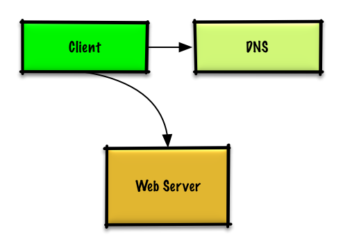
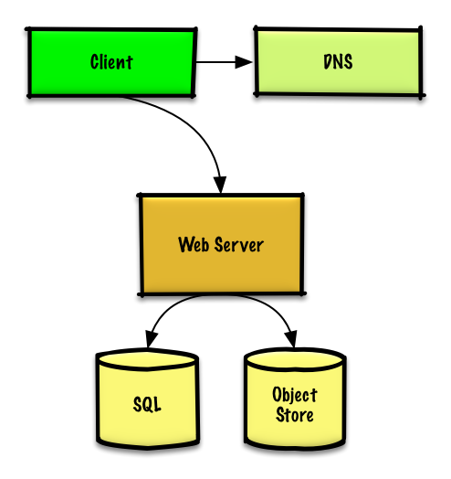
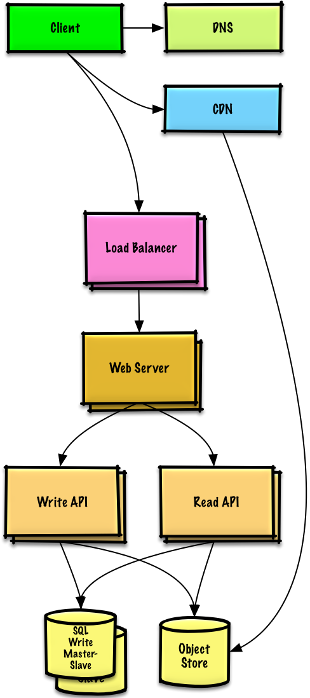
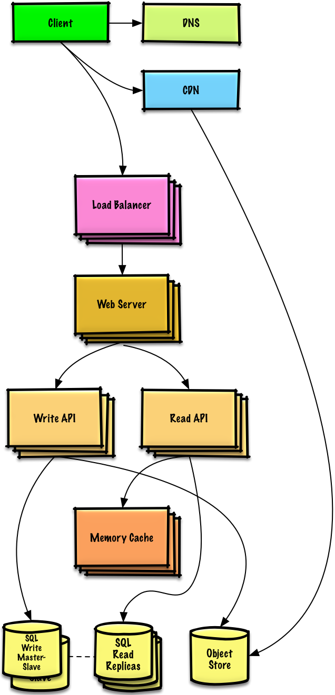
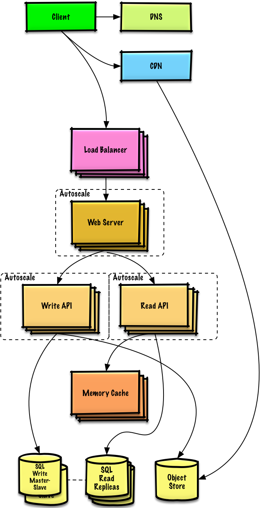
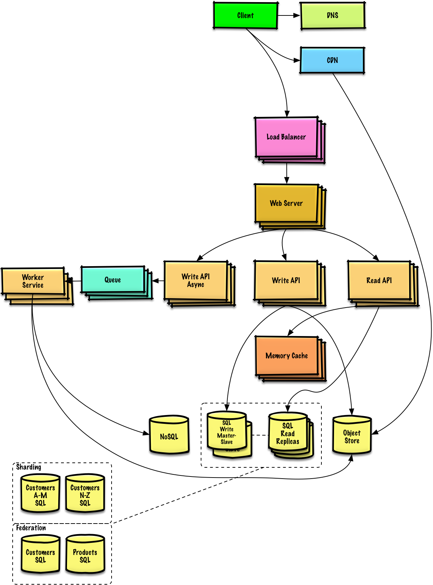

# Design a system that scales to millions of users on AWS

> **How to use this exercise:** work through it yourself using the [four-step framework](../../../study-guide/interview-approach.md) *before* reading the solution below. Links point into the [topic modules](../../../README.md) rather than repeating their content — follow them for general talking points, trade-offs, and alternatives.

## Step 1: Outline use cases and constraints

> Gather requirements and scope the problem.
> Ask questions to clarify use cases and constraints.
> Discuss assumptions.

Without an interviewer to address clarifying questions, we'll define some use cases and constraints.

### Use cases

Solving this problem takes an iterative approach of: 1) **Benchmark/Load Test**, 2) **Profile** for bottlenecks 3) address bottlenecks while evaluating alternatives and trade-offs, and 4) repeat, which is good pattern for evolving basic designs to scalable designs.

Unless you have a background in AWS or are applying for a position that requires AWS knowledge, AWS-specific details are not a requirement.  However, **much of the principles discussed in this exercise can apply more generally outside of the AWS ecosystem.**

#### We'll scope the problem to handle only the following use cases

* **User** makes a read or write request
    * **Service** does processing, stores user data, then returns the results
* **Service** needs to evolve from serving a small amount of users to millions of users
    * Discuss general scaling patterns as we evolve an architecture to handle a large number of users and requests
* **Service** has high availability

### Constraints and assumptions

#### State assumptions

* Traffic is not evenly distributed
* Need for relational data
* Scale from 1 user to tens of millions of users
    * Denote increase of users as:
        * Users+
        * Users++
        * Users+++
        * ...
    * 10 million users
    * 1 billion writes per month
    * 100 billion reads per month
    * 100:1 read to write ratio
    * 1 KB content per write

#### Calculate usage

**Clarify with your interviewer if you should run back-of-the-envelope usage calculations.**

* 1 TB of new content per month
    * 1 KB per write * 1 billion writes per month
    * 36 TB of new content in 3 years
    * Assume most writes are from new content instead of updates to existing ones
* 400 writes per second on average
* 40,000 reads per second on average

Handy conversion guide:

* 2.5 million seconds per month
* 1 request per second = 2.5 million requests per month
* 40 requests per second = 100 million requests per month
* 400 requests per second = 1 billion requests per month

## Step 2: Create a high level design

> Outline a high level design with all important components.

## Step 3: Design core components

> Dive into details for each core component.

### Use case: User makes a read or write request

#### Goals

* With only 1-2 users, you only need a basic setup
    * Single box for simplicity
    * Vertical scaling when needed
    * Monitor to determine bottlenecks

#### Start with a single box

* **Web server** on EC2
    * Storage for user data
    * [**MySQL Database**](../../../data/rdbms.md)

Use **Vertical Scaling**:

* Simply choose a bigger box
* Keep an eye on metrics to determine how to scale up
    * Use basic monitoring to determine bottlenecks: CPU, memory, IO, network, etc
    * CloudWatch, top, nagios, statsd, graphite, etc
* Scaling vertically can get very expensive
* No redundancy/failover

*Trade-offs, alternatives, and additional details:*

* The alternative to **Vertical Scaling** is [**Horizontal scaling**](../../../networking/load-balancer.md#horizontal-scaling)

#### Start with SQL, consider NoSQL

The constraints assume there is a need for relational data.  We can start off using a **MySQL Database** on the single box.

*Trade-offs, alternatives, and additional details:*

* See the [Relational database management system (RDBMS)](../../../data/rdbms.md) section
* Discuss reasons to use [SQL or NoSQL](../../../data/sql-or-nosql.md)

#### Assign a public static IP

* Elastic IPs provide a public endpoint whose IP doesn't change on reboot
* Helps with failover, just point the domain to a new IP

#### Use a DNS

Add a **DNS** such as Route 53 to map the domain to the instance's public IP.

*Trade-offs, alternatives, and additional details:*

* See the [Domain name system](../../../networking/dns.md) section

#### Secure the web server

* Open up only necessary ports
    * Allow the web server to respond to incoming requests from:
        * 80 for HTTP
        * 443 for HTTPS
        * 22 for SSH to only whitelisted IPs
    * Prevent the web server from initiating outbound connections

*Trade-offs, alternatives, and additional details:*

* See the [Security](../../../security/security-basics.md) section

## Step 4: Scale the design

> Identify and address bottlenecks, given the constraints.

### Users+

#### Assumptions

Our user count is starting to pick up and the load is increasing on our single box.  Our **Benchmarks/Load Tests** and **Profiling** are pointing to the **MySQL Database** taking up more and more memory and CPU resources, while the user content is filling up disk space.

We've been able to address these issues with **Vertical Scaling** so far.  Unfortunately, this has become quite expensive and it doesn't allow for independent scaling of the **MySQL Database** and **Web Server**.

#### Goals

* Lighten load on the single box and allow for independent scaling
    * Store static content separately in an **Object Store**
    * Move the **MySQL Database** to a separate box
* Disadvantages
    * These changes would increase complexity and would require changes to the **Web Server** to point to the **Object Store** and the **MySQL Database**
    * Additional security measures must be taken to secure the new components
    * AWS costs could also increase, but should be weighed with the costs of managing similar systems on your own

#### Store static content separately

* Consider using a managed **Object Store** like S3 to store static content
    * Highly scalable and reliable
    * Server side encryption
* Move static content to S3
    * User files
    * JS
    * CSS
    * Images
    * Videos

#### Move the MySQL database to a separate box

* Consider using a service like RDS to manage the **MySQL Database**
    * Simple to administer, scale
    * Multiple availability zones
    * Encryption at rest

#### Secure the system

* Encrypt data in transit and at rest
* Use a Virtual Private Cloud
    * Create a public subnet for the single **Web Server** so it can send and receive traffic from the internet
    * Create a private subnet for everything else, preventing outside access
    * Only open ports from whitelisted IPs for each component
* These same patterns should be implemented for new components in the remainder of the exercise

*Trade-offs, alternatives, and additional details:*

* See the [Security](../../../security/security-basics.md) section

### Users++

#### Assumptions

Our **Benchmarks/Load Tests** and **Profiling** show that our single **Web Server** bottlenecks during peak hours, resulting in slow responses and in some cases, downtime.  As the service matures, we'd also like to move towards higher availability and redundancy.

#### Goals

* The following goals attempt to address the scaling issues with the **Web Server**
    * Based on the **Benchmarks/Load Tests** and **Profiling**, you might only need to implement one or two of these techniques
* Use [**Horizontal Scaling**](../../../networking/load-balancer.md#horizontal-scaling) to handle increasing loads and to address single points of failure
    * Add a [**Load Balancer**](../../../networking/load-balancer.md) such as Amazon's ELB or HAProxy
        * ELB is highly available
        * If you are configuring your own **Load Balancer**, setting up multiple servers in [active-active](../../../fundamentals/availability-patterns.md#active-active) or [active-passive](../../../fundamentals/availability-patterns.md#active-passive) in multiple availability zones will improve availability
        * Terminate SSL on the **Load Balancer** to reduce computational load on backend servers and to simplify certificate administration
    * Use multiple **Web Servers** spread out over multiple availability zones
    * Use multiple **MySQL** instances in [**Master-Slave Failover**](../../../data/replication.md#master-slave-replication) mode across multiple availability zones to improve redundancy
* Separate out the **Web Servers** from the [**Application Servers**](../../../application/application-layer.md)
    * Scale and configure both layers independently
    * **Web Servers** can run as a [**Reverse Proxy**](../../../networking/reverse-proxy.md)
    * For example, you can add **Application Servers** handling **Read APIs** while others handle **Write APIs**
* Move static (and some dynamic) content to a [**Content Delivery Network (CDN)**](../../../networking/cdn.md) such as CloudFront to reduce load and latency

*Trade-offs, alternatives, and additional details:*

* See the linked content above for details

### Users+++

**Note:** **Internal Load Balancers** not shown to reduce clutter

#### Assumptions

Our **Benchmarks/Load Tests** and **Profiling** show that we are read-heavy (100:1 with writes) and our database is suffering from poor performance from the high read requests.

#### Goals

* The following goals attempt to address the scaling issues with the **MySQL Database**
    * Based on the **Benchmarks/Load Tests** and **Profiling**, you might only need to implement one or two of these techniques
* Move the following data to a [**Memory Cache**](../../../caching/caching-overview.md) such as Elasticache to reduce load and latency:
    * Frequently accessed content from **MySQL**
        * First, try to configure the **MySQL Database** cache to see if that is sufficient to relieve the bottleneck before implementing a **Memory Cache**
    * Session data from the **Web Servers**
        * The **Web Servers** become stateless, allowing for **Autoscaling**
    * Reading 1 MB sequentially from memory takes about 250 microseconds, while reading from SSD takes 4x and from disk takes 80x longer.[1](../../../appendix/latency-numbers.md)
* Add [**MySQL Read Replicas**](../../../data/replication.md#master-slave-replication) to reduce load on the write master
* Add more **Web Servers** and **Application Servers** to improve responsiveness

*Trade-offs, alternatives, and additional details:*

* See the linked content above for details

#### Add MySQL read replicas

* In addition to adding and scaling a **Memory Cache**, **MySQL Read Replicas** can also help relieve load on the **MySQL Write Master**
* Add logic to **Web Server** to separate out writes and reads
* Add **Load Balancers** in front of **MySQL Read Replicas** (not pictured to reduce clutter)
* Most services are read-heavy vs write-heavy

*Trade-offs, alternatives, and additional details:*

* See the [Relational database management system (RDBMS)](../../../data/rdbms.md) section

### Users++++

#### Assumptions

Our **Benchmarks/Load Tests** and **Profiling** show that our traffic spikes during regular business hours in the U.S. and drop significantly when users leave the office.  We think we can cut costs by automatically spinning up and down servers based on actual load.  We're a small shop so we'd like to automate as much of the DevOps as possible for **Autoscaling** and for the general operations.

#### Goals

* Add **Autoscaling** to provision capacity as needed
    * Keep up with traffic spikes
    * Reduce costs by powering down unused instances
* Automate DevOps
    * Chef, Puppet, Ansible, etc
* Continue monitoring metrics to address bottlenecks
    * **Host level** - Review a single EC2 instance
    * **Aggregate level** - Review load balancer stats
    * **Log analysis** - CloudWatch, CloudTrail, Loggly, Splunk, Sumo
    * **External site performance** - Pingdom or New Relic
    * **Handle notifications and incidents** - PagerDuty
    * **Error Reporting** - Sentry

#### Add autoscaling

* Consider a managed service such as AWS **Autoscaling**
    * Create one group for each **Web Server** and one for each **Application Server** type, place each group in multiple availability zones
    * Set a min and max number of instances
    * Trigger to scale up and down through CloudWatch
        * Simple time of day metric for predictable loads or
        * Metrics over a time period:
            * CPU load
            * Latency
            * Network traffic
            * Custom metric
    * Disadvantages
        * Autoscaling can introduce complexity
        * It could take some time before a system appropriately scales up to meet increased demand, or to scale down when demand drops

### Users+++++

**Note:** **Autoscaling** groups not shown to reduce clutter

#### Assumptions

As the service continues to grow towards the figures outlined in the constraints, we iteratively run **Benchmarks/Load Tests** and **Profiling** to uncover and address new bottlenecks.

#### Goals

We'll continue to address scaling issues due to the problem's constraints:

* If our **MySQL Database** starts to grow too large, we might consider only storing a limited time period of data in the database, while storing the rest in a data warehouse such as Redshift
    * A data warehouse such as Redshift can comfortably handle the constraint of 1 TB of new content per month
* With 40,000 average read requests per second, read traffic for popular content can be addressed by scaling the **Memory Cache**, which is also useful for handling the unevenly distributed traffic and traffic spikes
    * The **SQL Read Replicas** might have trouble handling the cache misses, we'll probably need to employ additional SQL scaling patterns
* 400 average writes per second (with presumably significantly higher peaks) might be tough for a single **SQL Write Master-Slave**, also pointing to a need for additional scaling techniques

SQL scaling patterns include:

* [Federation](../../../data/federation.md)
* [Sharding](../../../data/sharding.md)
* [Denormalization](../../../data/denormalization.md)
* [SQL Tuning](../../../data/sql-tuning.md)

To further address the high read and write requests, we should also consider moving appropriate data to a [**NoSQL Database**](../../../data/nosql.md) such as DynamoDB.

We can further separate out our [**Application Servers**](../../../application/application-layer.md) to allow for independent scaling.  Batch processes or computations that do not need to be done in real-time can be done [**Asynchronously**](../../../application/asynchronism.md) with **Queues** and **Workers**:

* For example, in a photo service, the photo upload and the thumbnail creation can be separated:
    * **Client** uploads photo
    * **Application Server** puts a job in a **Queue** such as SQS
    * The **Worker Service** on EC2 or Lambda pulls work off the **Queue** then:
        * Creates a thumbnail
        * Updates a **Database**
        * Stores the thumbnail in the **Object Store**

*Trade-offs, alternatives, and additional details:*

* See the linked content above for details

## Additional talking points

> Additional topics to dive into, depending on the problem scope and time remaining.

### SQL scaling patterns

* [Read replicas](../../../data/replication.md#master-slave-replication)
* [Federation](../../../data/federation.md)
* [Sharding](../../../data/sharding.md)
* [Denormalization](../../../data/denormalization.md)
* [SQL Tuning](../../../data/sql-tuning.md)

#### NoSQL

* [Key-value store](../../../data/key-value-store.md)
* [Document store](../../../data/document-store.md)
* [Wide column store](../../../data/wide-column-store.md)
* [Graph database](../../../data/graph-database.md)
* [SQL vs NoSQL](../../../data/sql-or-nosql.md)

### Caching

* Where to cache
    * [Client caching](../../../caching/cache-locations.md#client-caching)
    * [CDN caching](../../../caching/cache-locations.md#cdn-caching)
    * [Web server caching](../../../caching/cache-locations.md#web-server-caching)
    * [Database caching](../../../caching/cache-locations.md#database-caching)
    * [Application caching](../../../caching/cache-locations.md#application-caching)
* What to cache
    * [Caching at the database query level](../../../caching/what-to-cache.md#caching-at-the-database-query-level)
    * [Caching at the object level](../../../caching/what-to-cache.md#caching-at-the-object-level)
* When to update the cache
    * [Cache-aside](../../../caching/cache-update-strategies.md#cache-aside)
    * [Write-through](../../../caching/cache-update-strategies.md#write-through)
    * [Write-behind (write-back)](../../../caching/cache-update-strategies.md#write-behind-write-back)
    * [Refresh ahead](../../../caching/cache-update-strategies.md#refresh-ahead)

### Asynchronism and microservices

* [Message queues](../../../application/asynchronism.md#message-queues)
* [Task queues](../../../application/asynchronism.md#task-queues)
* [Back pressure](../../../application/asynchronism.md#back-pressure)
* [Microservices](../../../application/microservices.md)

### Communications

* Discuss tradeoffs:
    * External communication with clients - [HTTP APIs following REST](../../../networking/rest.md)
    * Internal communications - [RPC](../../../networking/rpc.md)
* [Service discovery](../../../application/service-discovery.md)

### Security

Refer to the [security section](../../../security/security-basics.md).

### Latency numbers

See [Latency numbers every programmer should know](../../../appendix/latency-numbers.md).

### Ongoing

* Continue benchmarking and monitoring your system to address bottlenecks as they come up
* Scaling is an iterative process

## Self-check

1. What runs on the single box at the start, and what are the first three things you do to it?
2. At what point does vertical scaling stop being the right answer, and why?
3. In what order are these introduced: read replicas, separate database box, CDN, load balancer, separate static content? Justify the order.
4. Why are web servers made stateless before autoscaling is introduced, and where does session state go?
5. When do you reach for federation, sharding, denormalization, or SQL tuning — and what signals each?
6. At what point does the design move data to NoSQL, and which data moves first?
7. State the four-step iterative loop this exercise demonstrates.
