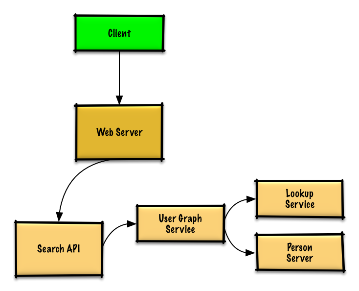
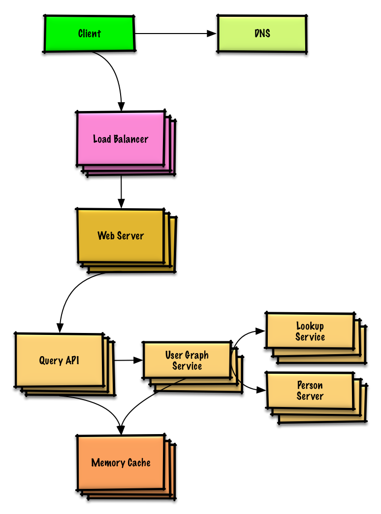

# Design the data structures for a social network

> **How to use this exercise:** work through it yourself using the [four-step framework](../../../study-guide/interview-approach.md) *before* reading the solution below. Links point into the [topic modules](../../../README.md) rather than repeating their content — follow them for general talking points, trade-offs, and alternatives.

## Step 1: Outline use cases and constraints

> Gather requirements and scope the problem.
> Ask questions to clarify use cases and constraints.
> Discuss assumptions.

Without an interviewer to address clarifying questions, we'll define some use cases and constraints.

### Use cases

#### We'll scope the problem to handle only the following use cases

* **User** searches for someone and sees the shortest path to the searched person
* **Service** has high availability

### Constraints and assumptions

#### State assumptions

* Traffic is not evenly distributed
    * Some searches are more popular than others, while others are only executed once
* Graph data won't fit on a single machine
* Graph edges are unweighted
* 100 million users
* 50 friends per user average
* 1 billion friend searches per month

Exercise the use of more traditional systems - don't use graph-specific solutions such as [GraphQL](http://graphql.org/) or a graph database like [Neo4j](https://neo4j.com/)

#### Calculate usage

**Clarify with your interviewer if you should run back-of-the-envelope usage calculations.**

* 5 billion friend relationships
    * 100 million users * 50 friends per user average
* 400 search requests per second

Handy conversion guide:

* 2.5 million seconds per month
* 1 request per second = 2.5 million requests per month
* 40 requests per second = 100 million requests per month
* 400 requests per second = 1 billion requests per month

## Step 2: Create a high level design

> Outline a high level design with all important components.



## Step 3: Design core components

> Dive into details for each core component.

### Use case: User searches for someone and sees the shortest path to the searched person

**Clarify with your interviewer how much code you are expected to write**.

Without the constraint of millions of users (vertices) and billions of friend relationships (edges), we could solve this unweighted shortest path task with a general BFS approach:

```python
class Graph(Graph):

    def shortest_path(self, source, dest):
        if source is None or dest is None:
            return None
        if source is dest:
            return [source.key]
        prev_node_keys = self._shortest_path(source, dest)
        if prev_node_keys is None:
            return None
        else:
            path_ids = [dest.key]
            prev_node_key = prev_node_keys[dest.key]
            while prev_node_key is not None:
                path_ids.append(prev_node_key)
                prev_node_key = prev_node_keys[prev_node_key]
            return path_ids[::-1]

    def _shortest_path(self, source, dest):
        queue = deque()
        queue.append(source)
        prev_node_keys = {source.key: None}
        source.visit_state = State.visited
        while queue:
            node = queue.popleft()
            if node is dest:
                return prev_node_keys
            prev_node = node
            for adj_node in node.adj_nodes.values():
                if adj_node.visit_state == State.unvisited:
                    queue.append(adj_node)
                    prev_node_keys[adj_node.key] = prev_node.key
                    adj_node.visit_state = State.visited
        return None
```

We won't be able to fit all users on the same machine, we'll need to [shard](../../../data/sharding.md) users across **Person Servers** and access them with a **Lookup Service**.

* The **Client** sends a request to the **Web Server**, running as a [reverse proxy](../../../networking/reverse-proxy.md)
* The **Web Server** forwards the request to the **Search API** server
* The **Search API** server forwards the request to the **User Graph Service**
* The **User Graph Service** does the following:
    * Uses the **Lookup Service** to find the **Person Server** where the current user's info is stored
    * Finds the appropriate **Person Server** to retrieve the current user's list of `friend_ids`
    * Runs a BFS search using the current user as the `source` and the current user's `friend_ids` as the ids for each `adjacent_node`
    * To get the `adjacent_node` from a given id:
        * The **User Graph Service** will *again* need to communicate with the **Lookup Service** to determine which **Person Server** stores the`adjacent_node` matching the given id (potential for optimization)

**Clarify with your interviewer how much code you should be writing**.

**Note**: Error handling is excluded below for simplicity.  Ask if you should code proper error handing.

**Lookup Service** implementation:

```python
class LookupService(object):

    def __init__(self):
        self.lookup = self._init_lookup()  # key: person_id, value: person_server

    def _init_lookup(self):
        ...

    def lookup_person_server(self, person_id):
        return self.lookup[person_id]
```

**Person Server** implementation:

```python
class PersonServer(object):

    def __init__(self):
        self.people = {}  # key: person_id, value: person

    def add_person(self, person):
        ...

    def people(self, ids):
        results = []
        for id in ids:
            if id in self.people:
                results.append(self.people[id])
        return results
```

**Person** implementation:

```python
class Person(object):

    def __init__(self, id, name, friend_ids):
        self.id = id
        self.name = name
        self.friend_ids = friend_ids
```

**User Graph Service** implementation:

```python
class UserGraphService(object):

    def __init__(self, lookup_service):
        self.lookup_service = lookup_service

    def person(self, person_id):
        person_server = self.lookup_service.lookup_person_server(person_id)
        return person_server.people([person_id])

    def shortest_path(self, source_key, dest_key):
        if source_key is None or dest_key is None:
            return None
        if source_key is dest_key:
            return [source_key]
        prev_node_keys = self._shortest_path(source_key, dest_key)
        if prev_node_keys is None:
            return None
        else:
            # Iterate through the path_ids backwards, starting at dest_key
            path_ids = [dest_key]
            prev_node_key = prev_node_keys[dest_key]
            while prev_node_key is not None:
                path_ids.append(prev_node_key)
                prev_node_key = prev_node_keys[prev_node_key]
            # Reverse the list since we iterated backwards
            return path_ids[::-1]

    def _shortest_path(self, source_key, dest_key, path):
        # Use the id to get the Person
        source = self.person(source_key)
        # Update our bfs queue
        queue = deque()
        queue.append(source)
        # prev_node_keys keeps track of each hop from
        # the source_key to the dest_key
        prev_node_keys = {source_key: None}
        # We'll use visited_ids to keep track of which nodes we've
        # visited, which can be different from a typical bfs where
        # this can be stored in the node itself
        visited_ids = set()
        visited_ids.add(source.id)
        while queue:
            node = queue.popleft()
            if node.key is dest_key:
                return prev_node_keys
            prev_node = node
            for friend_id in node.friend_ids:
                if friend_id not in visited_ids:
                    friend_node = self.person(friend_id)
                    queue.append(friend_node)
                    prev_node_keys[friend_id] = prev_node.key
                    visited_ids.add(friend_id)
        return None
```

We'll use a public [**REST API**](../../../networking/rest.md):

```
$ curl https://social.com/api/v1/friend_search?person_id=1234
```

Response:

```
{
    "person_id": "100",
    "name": "foo",
    "link": "https://social.com/foo",
},
{
    "person_id": "53",
    "name": "bar",
    "link": "https://social.com/bar",
},
{
    "person_id": "1234",
    "name": "baz",
    "link": "https://social.com/baz",
},
```

For internal communications, we could use [Remote Procedure Calls](../../../networking/rpc.md).

## Step 4: Scale the design

> Identify and address bottlenecks, given the constraints.



**Important: Do not simply jump right into the final design from the initial design!**

State you would 1) **Benchmark/Load Test**, 2) **Profile** for bottlenecks 3) address bottlenecks while evaluating alternatives and trade-offs, and 4) repeat.  See [Design a system that scales to millions of users on AWS](../scaling-aws/README.md) as a sample on how to iteratively scale the initial design.

It's important to discuss what bottlenecks you might encounter with the initial design and how you might address each of them.  For example, what issues are addressed by adding a **Load Balancer** with multiple **Web Servers**?  **CDN**?  **Master-Slave Replicas**?  What are the alternatives and **Trade-Offs** for each?

We'll introduce some components to complete the design and to address scalability issues.  Internal load balancers are not shown to reduce clutter.

*To avoid repeating discussions*, refer to the following [system design topics](../../../README.md#index-of-system-design-topics) for main talking points, tradeoffs, and alternatives:

* [DNS](../../../networking/dns.md)
* [Load balancer](../../../networking/load-balancer.md)
* [Horizontal scaling](../../../networking/load-balancer.md#horizontal-scaling)
* [Web server (reverse proxy)](../../../networking/reverse-proxy.md)
* [API server (application layer)](../../../application/application-layer.md)
* [Cache](../../../caching/caching-overview.md)
* [Consistency patterns](../../../fundamentals/consistency-patterns.md)
* [Availability patterns](../../../fundamentals/availability-patterns.md)

To address the constraint of 400 *average* read requests per second (higher at peak), person data can be served from a **Memory Cache** such as Redis or Memcached to reduce response times and to reduce traffic to downstream services.  This could be especially useful for people who do multiple searches in succession and for people who are well-connected.  Reading 1 MB sequentially from memory takes about 250 microseconds, while reading from SSD takes 4x and from disk takes 80x longer.<sup>[1](../../../appendix/latency-numbers.md)</sup>

Below are further optimizations:

* Store complete or partial BFS traversals to speed up subsequent lookups in the **Memory Cache**
* Batch compute offline then store complete or partial BFS traversals to speed up subsequent lookups in a **NoSQL Database**
* Reduce machine jumps by batching together friend lookups hosted on the same **Person Server**
    * [Shard](../../../data/sharding.md) **Person Servers** by location to further improve this, as friends generally live closer to each other
* Do two BFS searches at the same time, one starting from the source, and one from the destination, then merge the two paths
* Start the BFS search from people with large numbers of friends, as they are more likely to reduce the number of [degrees of separation](https://en.wikipedia.org/wiki/Six_degrees_of_separation) between the current user and the search target
* Set a limit based on time or number of hops before asking the user if they want to continue searching, as searching could take a considerable amount of time in some cases
* Use a **Graph Database** such as [Neo4j](https://neo4j.com/) or a graph-specific query language such as [GraphQL](http://graphql.org/) (if there were no constraint preventing the use of **Graph Databases**)

## Additional talking points

> Additional topics to dive into, depending on the problem scope and time remaining.

### SQL scaling patterns

* [Read replicas](../../../data/replication.md#master-slave-replication)
* [Federation](../../../data/federation.md)
* [Sharding](../../../data/sharding.md)
* [Denormalization](../../../data/denormalization.md)
* [SQL Tuning](../../../data/sql-tuning.md)

#### NoSQL

* [Key-value store](../../../data/key-value-store.md)
* [Document store](../../../data/document-store.md)
* [Wide column store](../../../data/wide-column-store.md)
* [Graph database](../../../data/graph-database.md)
* [SQL vs NoSQL](../../../data/sql-or-nosql.md)

### Caching

* Where to cache
    * [Client caching](../../../caching/cache-locations.md#client-caching)
    * [CDN caching](../../../caching/cache-locations.md#cdn-caching)
    * [Web server caching](../../../caching/cache-locations.md#web-server-caching)
    * [Database caching](../../../caching/cache-locations.md#database-caching)
    * [Application caching](../../../caching/cache-locations.md#application-caching)
* What to cache
    * [Caching at the database query level](../../../caching/what-to-cache.md#caching-at-the-database-query-level)
    * [Caching at the object level](../../../caching/what-to-cache.md#caching-at-the-object-level)
* When to update the cache
    * [Cache-aside](../../../caching/cache-update-strategies.md#cache-aside)
    * [Write-through](../../../caching/cache-update-strategies.md#write-through)
    * [Write-behind (write-back)](../../../caching/cache-update-strategies.md#write-behind-write-back)
    * [Refresh ahead](../../../caching/cache-update-strategies.md#refresh-ahead)

### Asynchronism and microservices

* [Message queues](../../../application/asynchronism.md#message-queues)
* [Task queues](../../../application/asynchronism.md#task-queues)
* [Back pressure](../../../application/asynchronism.md#back-pressure)
* [Microservices](../../../application/microservices.md)

### Communications

* Discuss tradeoffs:
    * External communication with clients - [HTTP APIs following REST](../../../networking/rest.md)
    * Internal communications - [RPC](../../../networking/rpc.md)
* [Service discovery](../../../application/service-discovery.md)

### Security

Refer to the [security section](../../../security/security-basics.md).

### Latency numbers

See [Latency numbers every programmer should know](../../../appendix/latency-numbers.md).

### Ongoing

* Continue benchmarking and monitoring your system to address bottlenecks as they come up
* Scaling is an iterative process

## Self-check

1. Why can't the graph live on a single machine, and what does that force in the design?
2. What is the role of the Lookup Service relative to the Person Servers?
3. Which traversal algorithm fits unweighted edges, and why not the weighted alternative?
4. What makes a shortest-path search expensive once the graph is sharded across machines?
5. How does the design reduce the number of machine-to-machine hops during a search?
6. 5 billion friend relationships at 400 searches/s — where would you cache, and what would you cache?
