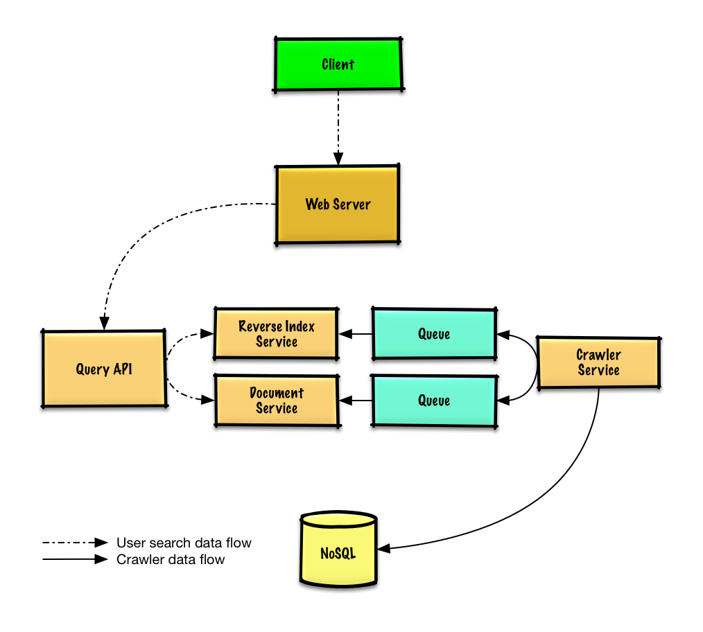
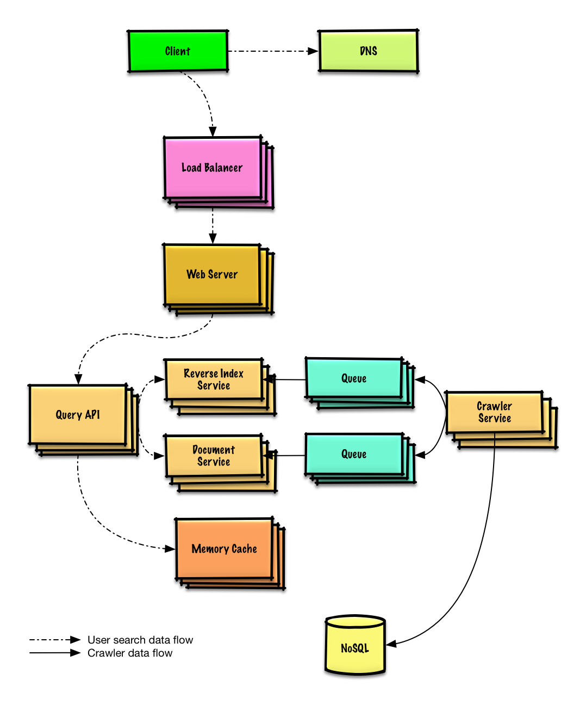

# Design a web crawler

> **How to use this exercise:** work through it yourself using the [four-step framework](../../../study-guide/interview-approach.md) *before* reading the solution below. Links point into the [topic modules](../../../README.md) rather than repeating their content — follow them for general talking points, trade-offs, and alternatives.

## Step 1: Outline use cases and constraints

> Gather requirements and scope the problem.
> Ask questions to clarify use cases and constraints.
> Discuss assumptions.

Without an interviewer to address clarifying questions, we'll define some use cases and constraints.

### Use cases

#### We'll scope the problem to handle only the following use cases

* **Service** crawls a list of urls:
    * Generates reverse index of words to pages containing the search terms
    * Generates titles and snippets for pages
        * Title and snippets are static, they do not change based on search query
* **User** inputs a search term and sees a list of relevant pages with titles and snippets  the crawler generated
    * Only sketch high level components and interactions for this use case, no need to go into depth
* **Service** has high availability

#### Out of scope

* Search analytics
* Personalized search results
* Page rank

### Constraints and assumptions

#### State assumptions

* Traffic is not evenly distributed
    * Some searches are very popular, while others are only executed once
* Support only anonymous users
* Generating search results should be fast
* The web crawler should not get stuck in an infinite loop
    * We get stuck in an infinite loop if the graph contains a cycle
* 1 billion links to crawl
    * Pages need to be crawled regularly to ensure freshness
    * Average refresh rate of about once per week, more frequent for popular sites
        * 4 billion links crawled each month
    * Average stored size per web page: 500 KB
        * For simplicity, count changes the same as new pages
* 100 billion searches per month

Exercise the use of more traditional systems - don't use existing systems such as [solr](http://lucene.apache.org/solr/) or [nutch](http://nutch.apache.org/).

#### Calculate usage

**Clarify with your interviewer if you should run back-of-the-envelope usage calculations.**

* 2 PB of stored page content per month
    * 500 KB per page * 4 billion links crawled per month
    * 72 PB of stored page content in 3 years
* 1,600 write requests per second
* 40,000 search requests per second

Handy conversion guide:

* 2.5 million seconds per month
* 1 request per second = 2.5 million requests per month
* 40 requests per second = 100 million requests per month
* 400 requests per second = 1 billion requests per month

## Step 2: Create a high level design

> Outline a high level design with all important components.



## Step 3: Design core components

> Dive into details for each core component.

### Use case: Service crawls a list of urls

We'll assume we have an initial list of `links_to_crawl` ranked initially based on overall site popularity.  If this is not a reasonable assumption, we can seed the crawler with popular sites that link to outside content such as [Yahoo](https://www.yahoo.com/), [DMOZ](http://www.dmoz.org/), etc.

We'll use a table `crawled_links` to store processed links and their page signatures.

We could store `links_to_crawl` and `crawled_links` in a key-value **NoSQL Database**.  For the ranked links in `links_to_crawl`, we could use [Redis](https://redis.io/) with sorted sets to maintain a ranking of page links.  We should discuss the [use cases and tradeoffs between choosing SQL or NoSQL](../../../data/sql-or-nosql.md).

* The **Crawler Service** processes each page link by doing the following in a loop:
    * Takes the top ranked page link to crawl
        * Checks `crawled_links` in the **NoSQL Database** for an entry with a similar page signature
            * If we have a similar page, reduces the priority of the page link
                * This prevents us from getting into a cycle
                * Continue
            * Else, crawls the link
                * Adds a job to the **Reverse Index Service** queue to generate a [reverse index](https://en.wikipedia.org/wiki/Search_engine_indexing)
                * Adds a job to the **Document Service** queue to generate a static title and snippet
                * Generates the page signature
                * Removes the link from `links_to_crawl` in the **NoSQL Database**
                * Inserts the page link and signature to `crawled_links` in the **NoSQL Database**

**Clarify with your interviewer how much code you are expected to write**.

`PagesDataStore` is an abstraction within the **Crawler Service** that uses the **NoSQL Database**:

```python
class PagesDataStore(object):

    def __init__(self, db);
        self.db = db
        ...

    def add_link_to_crawl(self, url):
        """Add the given link to `links_to_crawl`."""
        ...

    def remove_link_to_crawl(self, url):
        """Remove the given link from `links_to_crawl`."""
        ...

    def reduce_priority_link_to_crawl(self, url)
        """Reduce the priority of a link in `links_to_crawl` to avoid cycles."""
        ...

    def extract_max_priority_page(self):
        """Return the highest priority link in `links_to_crawl`."""
        ...

    def insert_crawled_link(self, url, signature):
        """Add the given link to `crawled_links`."""
        ...

    def crawled_similar(self, signature):
        """Determine if we've already crawled a page matching the given signature"""
        ...
```

`Page` is an abstraction within the **Crawler Service** that encapsulates a page, its contents, child urls, and signature:

```python
class Page(object):

    def __init__(self, url, contents, child_urls, signature):
        self.url = url
        self.contents = contents
        self.child_urls = child_urls
        self.signature = signature
```

`Crawler` is the main class within **Crawler Service**, composed of `Page` and `PagesDataStore`.

```python
class Crawler(object):

    def __init__(self, data_store, reverse_index_queue, doc_index_queue):
        self.data_store = data_store
        self.reverse_index_queue = reverse_index_queue
        self.doc_index_queue = doc_index_queue

    def create_signature(self, page):
        """Create signature based on url and contents."""
        ...

    def crawl_page(self, page):
        for url in page.child_urls:
            self.data_store.add_link_to_crawl(url)
        page.signature = self.create_signature(page)
        self.data_store.remove_link_to_crawl(page.url)
        self.data_store.insert_crawled_link(page.url, page.signature)

    def crawl(self):
        while True:
            page = self.data_store.extract_max_priority_page()
            if page is None:
                break
            if self.data_store.crawled_similar(page.signature):
                self.data_store.reduce_priority_link_to_crawl(page.url)
            else:
                self.crawl_page(page)
```

### Handling duplicates

We need to be careful the web crawler doesn't get stuck in an infinite loop, which happens when the graph contains a cycle.

**Clarify with your interviewer how much code you are expected to write**.

We'll want to remove duplicate urls:

* For smaller lists we could use something like `sort | unique`
* With 1 billion links to crawl, we could use **MapReduce** to output only entries that have a frequency of 1

```python
class RemoveDuplicateUrls(MRJob):

    def mapper(self, _, line):
        yield line, 1

    def reducer(self, key, values):
        total = sum(values)
        if total == 1:
            yield key, total
```

Detecting duplicate content is more complex.  We could generate a signature based on the contents of the page and compare those two signatures for similarity.  Some potential algorithms are [Jaccard index](https://en.wikipedia.org/wiki/Jaccard_index) and [cosine similarity](https://en.wikipedia.org/wiki/Cosine_similarity).

### Determining when to update the crawl results

Pages need to be crawled regularly to ensure freshness.  Crawl results could have a `timestamp` field that indicates the last time a page was crawled.  After a default time period, say one week, all pages should be refreshed.  Frequently updated or more popular sites could be refreshed in shorter intervals.

Although we won't dive into details on analytics, we could do some data mining to determine the mean time before a particular page is updated, and use that statistic to determine how often to re-crawl the page.

We might also choose to support a `Robots.txt` file that gives webmasters control of crawl frequency.

### Use case: User inputs a search term and sees a list of relevant pages with titles and snippets

* The **Client** sends a request to the **Web Server**, running as a [reverse proxy](../../../networking/reverse-proxy.md)
* The **Web Server** forwards the request to the **Query API** server
* The **Query API** server does the following:
    * Parses the query
        * Removes markup
        * Breaks up the text into terms
        * Fixes typos
        * Normalizes capitalization
        * Converts the query to use boolean operations
    * Uses the **Reverse Index Service** to find documents matching the query
        * The **Reverse Index Service** ranks the matching results and returns the top ones
    * Uses the **Document Service** to return titles and snippets

We'll use a public [**REST API**](../../../networking/rest.md):

```
$ curl https://search.com/api/v1/search?query=hello+world
```

Response:

```
{
    "title": "foo's title",
    "snippet": "foo's snippet",
    "link": "https://foo.com",
},
{
    "title": "bar's title",
    "snippet": "bar's snippet",
    "link": "https://bar.com",
},
{
    "title": "baz's title",
    "snippet": "baz's snippet",
    "link": "https://baz.com",
},
```

For internal communications, we could use [Remote Procedure Calls](../../../networking/rpc.md).

## Step 4: Scale the design

> Identify and address bottlenecks, given the constraints.



**Important: Do not simply jump right into the final design from the initial design!**

State you would 1) **Benchmark/Load Test**, 2) **Profile** for bottlenecks 3) address bottlenecks while evaluating alternatives and trade-offs, and 4) repeat.  See [Design a system that scales to millions of users on AWS](../scaling-aws/README.md) as a sample on how to iteratively scale the initial design.

It's important to discuss what bottlenecks you might encounter with the initial design and how you might address each of them.  For example, what issues are addressed by adding a **Load Balancer** with multiple **Web Servers**?  **CDN**?  **Master-Slave Replicas**?  What are the alternatives and **Trade-Offs** for each?

We'll introduce some components to complete the design and to address scalability issues.  Internal load balancers are not shown to reduce clutter.

*To avoid repeating discussions*, refer to the following [system design topics](../../../README.md#index-of-system-design-topics) for main talking points, tradeoffs, and alternatives:

* [DNS](../../../networking/dns.md)
* [Load balancer](../../../networking/load-balancer.md)
* [Horizontal scaling](../../../networking/load-balancer.md#horizontal-scaling)
* [Web server (reverse proxy)](../../../networking/reverse-proxy.md)
* [API server (application layer)](../../../application/application-layer.md)
* [Cache](../../../caching/caching-overview.md)
* [NoSQL](../../../data/nosql.md)
* [Consistency patterns](../../../fundamentals/consistency-patterns.md)
* [Availability patterns](../../../fundamentals/availability-patterns.md)

Some searches are very popular, while others are only executed once.  Popular queries can be served from a **Memory Cache** such as Redis or Memcached to reduce response times and to avoid overloading the **Reverse Index Service** and **Document Service**.  The **Memory Cache** is also useful for handling the unevenly distributed traffic and traffic spikes.  Reading 1 MB sequentially from memory takes about 250 microseconds, while reading from SSD takes 4x and from disk takes 80x longer.<sup>[1](../../../appendix/latency-numbers.md)</sup>

Below are a few other optimizations to the **Crawling Service**:

* To handle the data size and request load, the **Reverse Index Service** and **Document Service** will likely need to make heavy use sharding and federation.
* DNS lookup can be a bottleneck, the **Crawler Service** can keep its own DNS lookup that is refreshed periodically
* The **Crawler Service** can improve performance and reduce memory usage by keeping many open connections at a time, referred to as [connection pooling](https://en.wikipedia.org/wiki/Connection_pool)
    * Switching to [UDP](../../../networking/tcp-and-udp.md#user-datagram-protocol-udp) could also boost performance
* Web crawling is bandwidth intensive, ensure there is enough bandwidth to sustain high throughput

## Additional talking points

> Additional topics to dive into, depending on the problem scope and time remaining.

### SQL scaling patterns

* [Read replicas](../../../data/replication.md#master-slave-replication)
* [Federation](../../../data/federation.md)
* [Sharding](../../../data/sharding.md)
* [Denormalization](../../../data/denormalization.md)
* [SQL Tuning](../../../data/sql-tuning.md)

#### NoSQL

* [Key-value store](../../../data/key-value-store.md)
* [Document store](../../../data/document-store.md)
* [Wide column store](../../../data/wide-column-store.md)
* [Graph database](../../../data/graph-database.md)
* [SQL vs NoSQL](../../../data/sql-or-nosql.md)

### Caching

* Where to cache
    * [Client caching](../../../caching/cache-locations.md#client-caching)
    * [CDN caching](../../../caching/cache-locations.md#cdn-caching)
    * [Web server caching](../../../caching/cache-locations.md#web-server-caching)
    * [Database caching](../../../caching/cache-locations.md#database-caching)
    * [Application caching](../../../caching/cache-locations.md#application-caching)
* What to cache
    * [Caching at the database query level](../../../caching/what-to-cache.md#caching-at-the-database-query-level)
    * [Caching at the object level](../../../caching/what-to-cache.md#caching-at-the-object-level)
* When to update the cache
    * [Cache-aside](../../../caching/cache-update-strategies.md#cache-aside)
    * [Write-through](../../../caching/cache-update-strategies.md#write-through)
    * [Write-behind (write-back)](../../../caching/cache-update-strategies.md#write-behind-write-back)
    * [Refresh ahead](../../../caching/cache-update-strategies.md#refresh-ahead)

### Asynchronism and microservices

* [Message queues](../../../application/asynchronism.md#message-queues)
* [Task queues](../../../application/asynchronism.md#task-queues)
* [Back pressure](../../../application/asynchronism.md#back-pressure)
* [Microservices](../../../application/microservices.md)

### Communications

* Discuss tradeoffs:
    * External communication with clients - [HTTP APIs following REST](../../../networking/rest.md)
    * Internal communications - [RPC](../../../networking/rpc.md)
* [Service discovery](../../../application/service-discovery.md)

### Security

Refer to the [security section](../../../security/security-basics.md).

### Latency numbers

See [Latency numbers every programmer should know](../../../appendix/latency-numbers.md).

### Ongoing

* Continue benchmarking and monitoring your system to address bottlenecks as they come up
* Scaling is an iterative process

## Self-check

1. What seeds the initial `links_to_crawl` list, and what do you do if you can't assume a popularity ranking?
2. How does the crawler avoid getting stuck in an infinite loop?
3. How are duplicate pages detected when two different URLs serve the same content?
4. What decides when a page gets re-crawled, and what gives webmasters control over that?
5. Why is Redis with sorted sets a good fit for `links_to_crawl` specifically?
6. At 1,600 writes/s and 40,000 searches/s, which side of the system needs the most attention?
