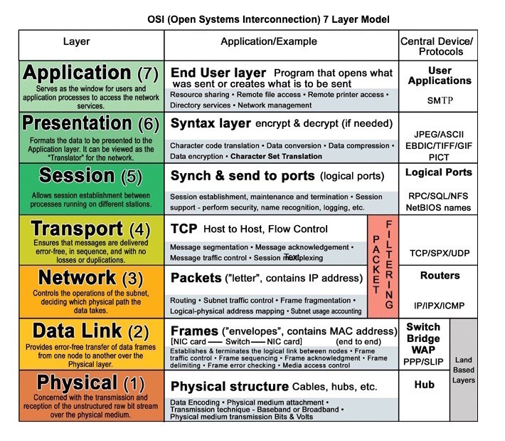

# Networking & Edge

  
   
  <i><a href="http://www.escotal.com/osilayer.html">Source: OSI 7 layer model</a></i>

Everything between the user typing a URL and your application code running: name resolution, edge
caching, traffic distribution, and the protocols services use to talk to each other.

## The request path

| # | Module | Time | Role in the path |
|---|---|---|---|
| 1 | [Domain name system](dns.md) | 5 min | Turns a name into an IP, and can steer traffic while doing it |
| 2 | [Content delivery network](cdn.md) | 5 min | Serves static (and sometimes dynamic) content from near the user |
| 3 | [Load balancer](load-balancer.md) | 8 min | Spreads requests across servers, terminates SSL, enables horizontal scaling |
| 4 | [Reverse proxy (web server)](reverse-proxy.md) | 4 min | Single public face for internal services; security, compression, caching |

## Communication protocols

| # | Module | Time | What it is |
|---|---|---|---|
| 5 | [Hypertext transfer protocol (HTTP)](http.md) | 4 min | Request/response encoding over TCP or UDP |
| 6 | [TCP and UDP](tcp-and-udp.md) | 6 min | Reliable-and-ordered vs fast-and-lossy transport |
| 7 | [Remote procedure call (RPC)](rpc.md) | 6 min | Exposing **behaviors**; typical for internal calls |
| 8 | [Representational state transfer (REST)](rest.md) | 6 min | Exposing **data**; typical for public APIs |

## Where this leads

* [Layer 4 vs layer 7 load balancing](load-balancer.md#layer-4-load-balancing) only makes sense once you know [TCP](tcp-and-udp.md#transmission-control-protocol-tcp) and [HTTP](http.md).
* CDNs are a kind of [cache](../caching/cache-locations.md#cdn-caching).
* Reverse proxies are also [web server caches](../caching/cache-locations.md#web-server-caching).
* Behind the load balancer sits the [application layer](../application/application-layer.md).
