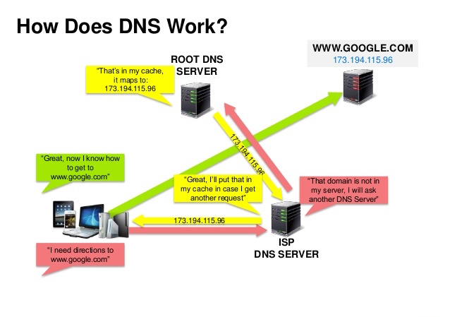

# Domain Name System (DNS)

  
   
  <i><a href="http://www.slideshare.net/srikrupa5/dns-security-presentation-issa">Source: DNS security presentation</a></i>

A Domain Name System (DNS) translates a domain name such as `www.example.com` to an IP address.

DNS is **hierarchical**, with a few authoritative servers at the top level. Your router or ISP
provides information about which DNS server(s) to contact when doing a lookup. Lower level DNS
servers **cache** mappings, which could become stale due to DNS propagation delays. DNS results can
also be cached by your browser or OS for a certain period of time, determined by the
[time to live (TTL)](https://en.wikipedia.org/wiki/Time_to_live).

DNS is the canonical example of [eventual consistency](../fundamentals/consistency-patterns.md#eventual-consistency).

## Record types

* **NS record (name server)** — specifies the DNS servers for your domain/subdomain.
* **MX record (mail exchange)** — specifies the mail servers for accepting messages.
* **A record (address)** — points a name to an IP address.
* **CNAME (canonical)** — points a name to another name or `CNAME` (`example.com` to `www.example.com`) or to an `A` record.

## Managed DNS and traffic routing

Services such as [CloudFlare](https://www.cloudflare.com/dns/) and
[Route 53](https://aws.amazon.com/route53/) provide managed DNS services. Some DNS services can
route traffic through various methods:

* [Weighted round robin](https://www.jscape.com/blog/load-balancing-algorithms)
    * Prevent traffic from going to servers under maintenance
    * Balance between varying cluster sizes
    * A/B testing
* [Latency-based](https://docs.aws.amazon.com/Route53/latest/DeveloperGuide/routing-policy-latency.html)
* [Geolocation-based](https://docs.aws.amazon.com/Route53/latest/DeveloperGuide/routing-policy-geo.html)

This makes DNS a *coarse* load balancing layer that sits in front of your
[load balancers](load-balancer.md). It is also how a public-facing
[active-active](../fundamentals/availability-patterns.md#active-active) pair is exposed, and how a
[CDN](cdn.md) tells clients which edge server to contact.

## Disadvantage(s): DNS

* Accessing a DNS server introduces a **slight delay**, although mitigated by caching described above.
* DNS server management could be complex and is generally managed by [governments, ISPs, and large companies](http://superuser.com/questions/472695/who-controls-the-dns-servers/472729).
* DNS services have come under [DDoS attack](http://dyn.com/blog/dyn-analysis-summary-of-friday-october-21-attack/), preventing users from accessing websites such as Twitter without knowing Twitter's IP address(es).

## Source(s) and further reading

* [DNS architecture](https://technet.microsoft.com/en-us/library/dd197427(v=ws.10).aspx)
* [Wikipedia](https://en.wikipedia.org/wiki/Domain_Name_System)
* [DNS articles](https://support.dnsimple.com/categories/dns/)

## Self-check

1. What do NS, MX, A, and CNAME records each do?
2. Why can a DNS change take time to take effect everywhere, and what controls that?
3. Name the three traffic routing methods a managed DNS service can offer, and a use case for each.
4. Give two disadvantages of depending on DNS.
