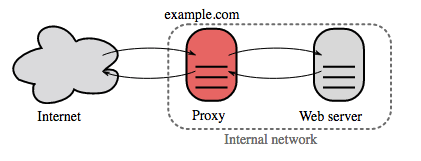

# Reverse Proxy (Web Server)

  
   
  <i><a href="https://upload.wikimedia.org/wikipedia/commons/6/67/Reverse_proxy_h2g2bob.svg">Source: Wikipedia</a></i>

A reverse proxy is a web server that **centralizes internal services and provides unified interfaces
to the public**. Requests from clients are forwarded to a server that can fulfill them, before the
reverse proxy returns the server's response to the client.

## Additional benefits

* **Increased security** — hide information about backend servers, blacklist IPs, limit number of connections per client
* **Increased scalability and flexibility** — clients only see the reverse proxy's IP, allowing you to scale servers or change their configuration
* **SSL termination** — decrypt incoming requests and encrypt server responses so backend servers do not have to perform these potentially expensive operations
    * Removes the need to install [X.509 certificates](https://en.wikipedia.org/wiki/X.509) on each server
* **Compression** — compress server responses
* **Caching** — return the response for cached requests (see [web server caching](../caching/cache-locations.md#web-server-caching))
* **Static content** — serve static content directly: HTML/CSS/JS, photos, videos, etc.

## Load balancer vs reverse proxy

* Deploying a [**load balancer**](load-balancer.md) is useful when you have **multiple servers**. Often, load balancers route traffic to a set of servers serving the same function.
* **Reverse proxies** can be useful even with **just one** web server or application server, opening up the benefits described above.
* Solutions such as **NGINX** and **HAProxy** can support both layer 7 reverse proxying and load balancing.

## Disadvantage(s): reverse proxy

* Introducing a reverse proxy results in **increased complexity**.
* A single reverse proxy is a **single point of failure**; configuring multiple reverse proxies (i.e. a [failover](https://en.wikipedia.org/wiki/Failover)) further increases complexity.

## Source(s) and further reading

* [Reverse proxy vs load balancer](https://www.nginx.com/resources/glossary/reverse-proxy-vs-load-balancer/)
* [NGINX architecture](https://www.nginx.com/blog/inside-nginx-how-we-designed-for-performance-scale/)
* [HAProxy architecture guide](http://www.haproxy.org/download/1.2/doc/architecture.txt)
* [Wikipedia](https://en.wikipedia.org/wiki/Reverse_proxy)

## Self-check

1. What does a reverse proxy give you that a bare application server does not?
2. When is a reverse proxy worth deploying even with a single backend server?
3. What is the practical difference between a load balancer and a reverse proxy, given NGINX can be both?
4. Name two disadvantages.
