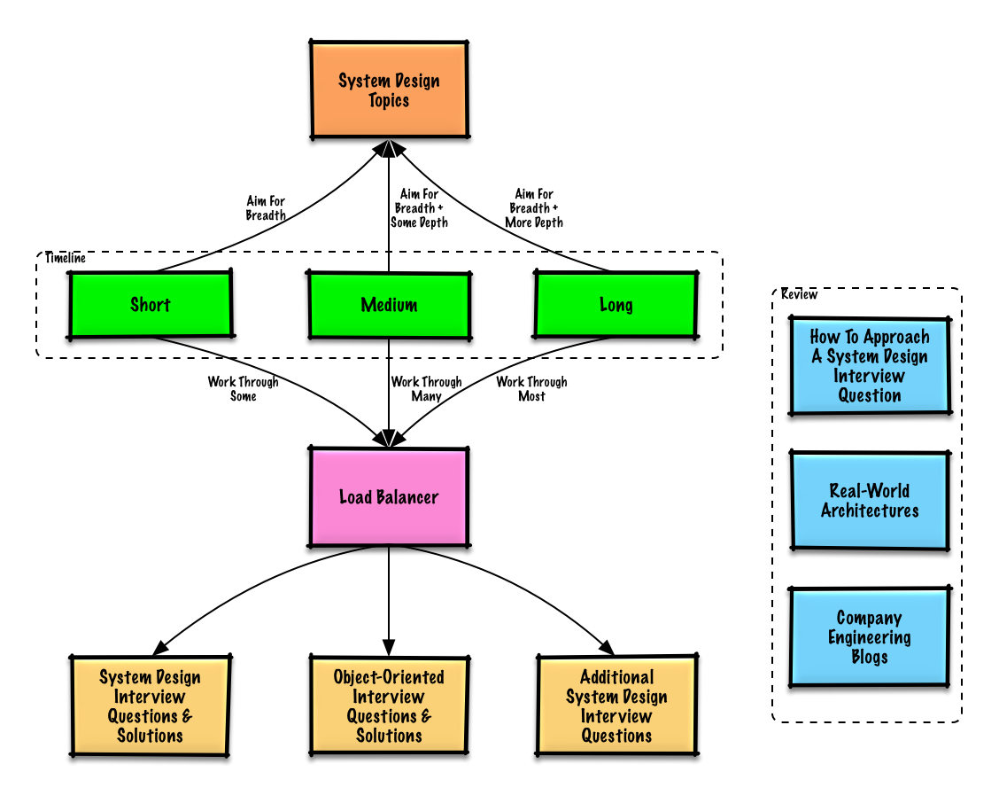

# Study Guide

> Suggested topics to review based on your interview timeline (short, medium, long).

## Q: For interviews, do I need to know everything here?

**A: No, you don't need to know everything here to prepare for the interview.**

What you are asked in an interview depends on variables such as:

* How much experience you have
* What your technical background is
* What positions you are interviewing for
* Which companies you are interviewing with
* Luck

More experienced candidates are generally expected to know more about system design. Architects or
team leads might be expected to know more than individual contributors. Top tech companies are
likely to have one or more design interview rounds.

**Start broad and go deeper in a few areas.** It helps to know a little about various key system
design topics. Adjust the following guide based on your timeline, experience, what positions you
are interviewing for, and which companies you are interviewing with.

## The three tracks

* **[Short timeline](short-timeline.md)** — Aim for **breadth** with system design topics. Practice by solving **some** interview questions.
* **[Medium timeline](medium-timeline.md)** — Aim for **breadth** and **some depth** with system design topics. Practice by solving **many** interview questions.
* **[Long timeline](long-timeline.md)** — Aim for **breadth** and **more depth** with system design topics. Practice by solving **most** interview questions.

## What each track covers

| Activity | Short | Medium | Long |
|---|---|---|---|
| Read through the [system design topics](../README.md#index-of-system-design-topics) to get a broad understanding of how systems work | ✔ | ✔ | ✔ |
| Read through a few articles in the [company engineering blogs](../appendix/engineering-blogs.md) for the companies you are interviewing with | ✔ | ✔ | ✔ |
| Read through a few [real world architectures](../appendix/real-world-architectures.md) | ✔ | ✔ | ✔ |
| Review [how to approach a system design interview question](interview-approach.md) | ✔ | ✔ | ✔ |
| Work through [system design interview questions with solutions](../exercises/system-design/README.md) | Some | Many | Most |
| Work through [object-oriented design interview questions with solutions](../exercises/object-oriented-design/README.md) | Some | Many | Most |
| Review [additional system design interview questions](../appendix/additional-questions.md) | Some | Many | Most |

Notice what is **identical across all three tracks**: the breadth pass over the topics, the
engineering blogs, the real world architectures, and the interview framework. Those are the floor.
The tracks differ only in **how many exercises you work through** — and, implicitly, how much depth
you develop by working them.

## Also in this module

* **[How to approach a system design interview question](interview-approach.md)** — the four-step framework
* **[Anki flashcards](flashcards.md)** — spaced repetition decks
* **[Additional resources for interview prep](../appendix/README.md)**

## Self-check

1. Name the four activities that appear in every timeline, regardless of how much time you have.
2. What is the only dimension along which the short, medium, and long tracks actually differ?
3. Why does the guide recommend "start broad and go deeper in a few areas" rather than mastering everything?
