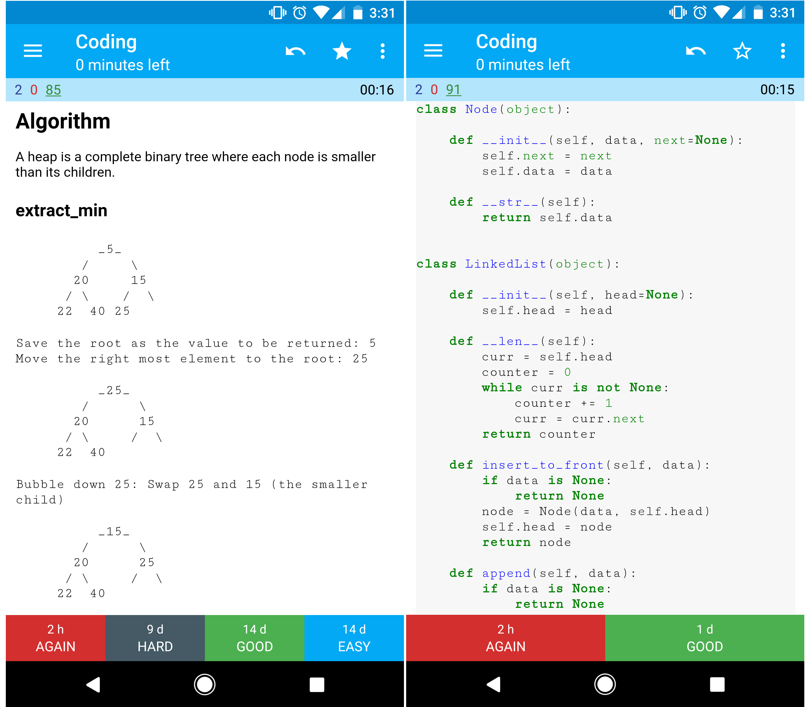

# Anki Flashcards and Spaced Repetition

The primer provides [Anki flashcard decks](https://apps.ankiweb.net/) that use **spaced repetition**
to help you retain key system design concepts. Great for use while on-the-go.

* [System design deck](https://github.com/donnemartin/system-design-primer/tree/master/resources/flash_cards/System%20Design.apkg)
* [System design exercises deck](https://github.com/donnemartin/system-design-primer/tree/master/resources/flash_cards/System%20Design%20Exercises.apkg)
* [Object oriented design exercises deck](https://github.com/donnemartin/system-design-primer/tree/master/resources/flash_cards/OO%20Design.apkg)

## Coding resource: Interactive Coding Challenges

Looking for resources to prep for the [coding interview](https://github.com/donnemartin/interactive-coding-challenges)?
The sister repo [**Interactive Coding Challenges**](https://github.com/donnemartin/interactive-coding-challenges)
contains an additional deck:

* [Coding deck](https://github.com/donnemartin/interactive-coding-challenges/tree/master/anki_cards/Coding.apkg)

## In-app review queue

Every concept module in this path ends with a **Self-check** section. Those questions are written to
be liftable directly into a review queue — one card per question, with the module body as the
answer. The frontmatter `id` gives each card a stable deck key, and `tags` gives it a deck grouping.
